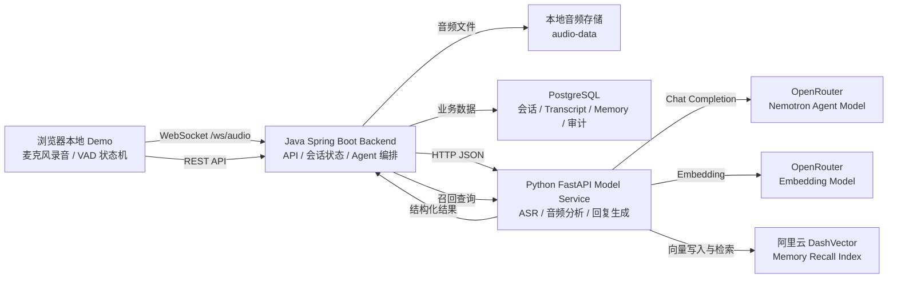
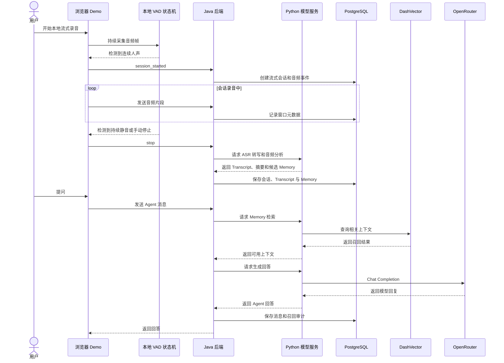

# Chrono Agent

## 项目介绍

Chrono Agent 是一个面向智能项链场景的个人 Agent MVP。项目目标是在用户授权范围内记录本地音频与健康事件，沉淀可追溯的生活上下文，并通过 Agent 提供日常复盘、互动理解、记忆召回和温和的生活助手能力。

当前 Demo 不依赖真实硬件。它通过浏览器麦克风、本地 WebSocket 流式录音、Java 后端、Python 模型服务和 PostgreSQL 验证核心链路：从录音会话产生，到转写、存储、记忆召回，再到 Agent 回答用户问题。

## 架构实现

系统由三个主要部分组成：

- `backend`：Java 21 + Spring Boot 后端，负责静态 Demo 页面、REST API、`/ws/audio` WebSocket 音频流、会话状态、持久化、Agent 编排、安全策略和审计记录。
- `model-service`：Python 3.11+ + FastAPI 模型服务，负责音频分析、增量转写、Agent 回复、文本 embedding、DashVector 写入和召回。模型能力通过 provider adapter 隔离，便于替换真实 ASR、声纹、LLM 和向量服务。
- `PostgreSQL`：主业务数据库，由 Flyway 管理 schema，保存音频事件、流式会话、会话记录、Transcript、说话人聚类、候选记忆、长期记忆、Agent 消息、召回事件、模型任务和审计日志。

Java 后端是产品状态的唯一可信来源。Python 模型服务保持无状态，不直接写 PostgreSQL，也不直接决定人物身份或长期记忆是否保存。Agent 召回使用阿里云 DashVector，但完整业务事实仍以 PostgreSQL 为准。



## 核心流程



## 核心实现逻辑

本地 Demo 由 Java 后端提供静态页面，浏览器通过麦克风采集音频并连接 `/ws/audio?userId=demo-user`。前端在本地维护 VAD 状态机：检测到连续人声后进入会话态，发送 `session_started`；检测到持续静音或用户手动停止后发送 `stop`，后端关闭本次音频会话并进入后处理。

音频进入后端后，`AudioStreamWebSocketHandler` 和 `AudioStreamService` 负责管理流式会话、窗口片段、关闭原因和音频元数据。会话结束后，后端调用 Python 模型服务执行 ASR 转写和音频分析，再把结果写入会话记录、Transcript、说话人片段、候选记忆和模型任务状态。

Agent 对话由 Java 后端编排。用户消息先写入 `agent_message`，随后后端从 PostgreSQL 和 DashVector 召回相关会话、长期记忆、健康事件和人物洞察，组装上下文后调用 Python 的 Agent 回复接口。Python 通过 OpenRouter 生成回复；如果 LLM 或向量服务不可用，接口返回失败，系统不会静默降级成固定模板回复。

记忆写入遵循“会话记录先落库，长期记忆再确认”的原则。模型可以生成候选记忆，但敏感或不确定内容需要用户确认；长期记忆保留证据引用，支持后续审计、失效和替换。

## 本地部署

运行前需要准备 JDK 21+、Python 3.11+、Docker 和 Docker Compose。Java 后端默认端口为 `8080`，Python 模型服务默认端口为 `8000`，PostgreSQL 默认端口为 `5432`。

1. 启动 PostgreSQL：

   ```powershell
   docker compose up -d postgres
   ```

2. 启动 Python 模型服务：

   ```powershell
   cd model-service
   .\.venv\Scripts\pip install -e .
   $env:CHRONO_AUDIO_ANALYZE_PROVIDER="openrouter"
   $env:CHRONO_OPENROUTER_API_KEY="<your-openrouter-api-key>"
   $env:CHRONO_DASHVECTOR_API_KEY="<your-dashvector-api-key>"
   $env:CHRONO_DASHVECTOR_ENDPOINT="<your-dashvector-cluster-endpoint>"
   $env:CHRONO_DASHVECTOR_COLLECTION="chrono_agent_memory"
   .\.venv\Scripts\python -m uvicorn app.main:app --host 127.0.0.1 --port 8000
   ```

   常用模型和向量配置：

   - `CHRONO_OPENROUTER_MODEL`：默认 `nvidia/nemotron-3-nano-omni-30b-a3b-reasoning:free`。
   - `CHRONO_OPENROUTER_TRANSCRIPTION_MODEL`：默认 `qwen/qwen3-asr-flash-2026-02-10`，用于会话结束后的语音识别转写。
   - `CHRONO_OPENROUTER_EMBEDDING_MODEL`：默认 `nvidia/llama-nemotron-embed-vl-1b-v2:free`。
   - `CHRONO_EMBEDDING_DIMENSION`：默认 `2048`，DashVector collection 维度必须与它一致。

3. 启动 Java 后端：

   ```powershell
   cd backend
   .\mvnw spring-boot:run
   ```

4. 打开本地 Demo：

   ```text
   http://localhost:8080/
   ```

麦克风录音需要浏览器授权。建议使用 `http://localhost:8080/` 或 `http://127.0.0.1:8080/` 访问；局域网 HTTP 地址通常不满足浏览器麦克风安全上下文要求。

完整验证脚本：

```powershell
.\scripts\verify-mvp.ps1
```
