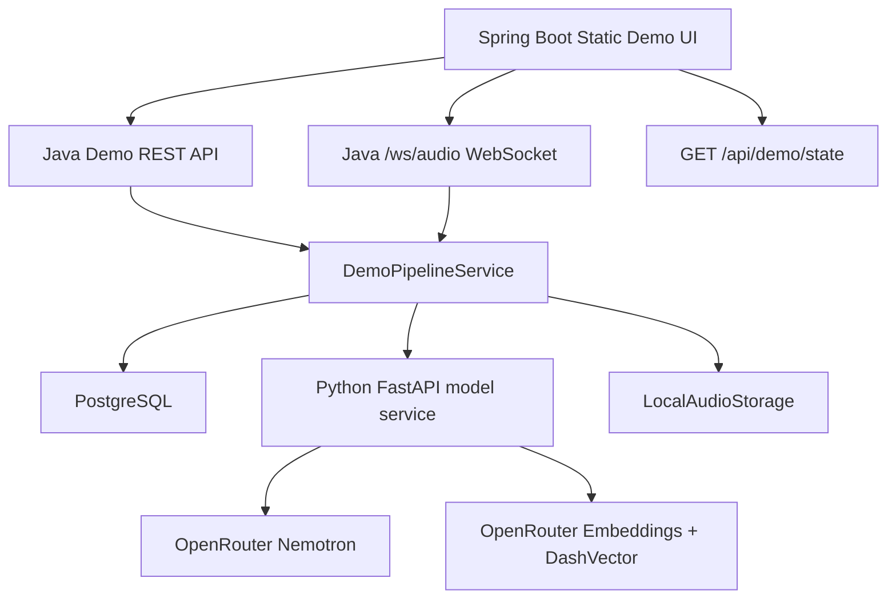

# Chrono Agent 全流程 Demo 设计

## 目标

本设计补充当前 MVP 的演示层和链路实现，使项目可以在浏览器中完整演示 Omi 式核心流程：

1. 用户选择测试用户。
2. 用户上传录音文件，或使用浏览器麦克风录音。
3. Java 后端保存音频、创建 `audio_event` 和 `model_job`。
4. Java 调用 Python fake analyzer，获得转写片段、说话人、声纹引用、摘要和候选记忆。
5. Java 写入 `conversation_memory`、`speaker_cluster`、`speaker_segment`、`speaker_embedding`、`memory_write_candidate` 和 `person_insight`。
6. 前端展示会话摘要、转写、周围人物、候选记忆、健康事件和 Agent 召回上下文。
7. 用户可以标注匿名人物，接受或拒绝候选记忆。
8. 用户发起 Agent 对话，Java 写入会话、消息、Agent run 和召回审计。

## 范围

本轮进入范围：

- Spring Boot 静态前端 Demo。
- 文件上传录音。
- 浏览器麦克风录音，录完后上传。
- WebSocket 音频流 Demo：浏览器按片段发送音频块，Java 在关闭时合并处理。
- Java 持久化 Demo pipeline。
- 关键用户数据展示：音频事件、会话记录、说话人、人物洞察、健康事件、候选记忆、长期记忆、Agent 消息、召回事件。
- 音频分析继续使用 Python fake provider；Agent 回复使用 OpenRouter 上的 NVIDIA Nemotron 3 Nano Omni。
- Agent 召回使用 OpenRouter embeddings + 阿里云 DashVector。

本轮不进入范围：

- 真实 ASR、真实说话人分离、真实声纹模型。
- 真实智能项链协议。
- 外部数据源。
- 生产级 WebSocket 流式实时转写。
- 生产级认证和多租户权限系统。

## 架构



Java 仍是唯一可信状态源。Python 只返回模型分析结果，不直接写数据库。

当前实现落地：

- Demo UI 位于 `backend/src/main/resources/static`，由 Spring Boot 直接托管。
- Demo REST API 由 `DemoController` 和 `DemoPipelineService` 提供。
- Java 调 Python 模型服务由 `ModelServiceClient` 完成，使用 `RestTemplate` 发送 HTTP JSON 请求，使用 `fastjson2` 序列化和反序列化。
- Java/Python 模型接口字段名保持 snake_case，Java DTO 使用 `@JSONField` 做字段映射。
- WebSocket 使用 Spring WebSocket `WebSocketHandler` 注册 `/ws/audio`，不是 `jakarta.websocket` 容器端点。
- 状态查询会把 PostgreSQL `jsonb` 字段归一化成普通 JSON 数组或对象，便于前端原始数据区展示。

## Demo API

新增或补强以下接口：

| 方法 | 路径 | 用途 |
| --- | --- | --- |
| `GET` | `/` | 打开前端 Demo |
| `POST` | `/api/demo/audio` | 上传录音文件并同步跑完分析链路 |
| `GET` | `/api/demo/state?userId=` | 查询当前用户全部可展示数据 |
| `POST` | `/api/demo/health` | 写入健康事件 |
| `PATCH` | `/api/demo/speakers/{speakerClusterId}/label` | 用户标注匿名人物 |
| `POST` | `/api/demo/memory-candidates/{candidateId}/accept` | 接受候选记忆 |
| `POST` | `/api/demo/memory-candidates/{candidateId}/reject` | 拒绝候选记忆 |
| `POST` | `/api/demo/agent/messages` | 发送 Agent 消息并持久化 run |
| `WS` | `/ws/audio?userId=` | 浏览器麦克风音频片段流 |

## WebSocket 协议

浏览器连接：

```text
ws://localhost:8080/ws/audio?userId=demo-user
```

消息规则：

- 客户端发送二进制音频片段。
- 客户端发送文本消息 `{"type":"stop","fileName":"browser-recording.webm"}` 结束录音。
- 服务端发送 JSON 状态：
  - `stream_opened`
  - `chunk_received`
  - `processing_started`
  - `processing_completed`
  - `error`

第一期 WebSocket 不是逐字实时转写，而是实时接收音频块，结束后合并处理，足够演示“浏览器麦克风实时流接入”。

当前流式会话约束：

- 同一 `userId` 同一时间只允许一个活跃 `audio_stream_session`。
- WebSocket 建连时写入 `audio_stream_session`，收到二进制片段后更新最后活跃时间。
- 收到 `stop` 后合并内存中的音频片段，复用 `DemoPipelineService.processAudio(...)` 进入统一音频分析链路。
- 处理完成后写入 `audio_event.stream_session_id`，并关闭对应 `audio_stream_session`。
- 如果浏览器异常断连，后端需要关闭内存态 session，并把流式会话标记为关闭或失败，避免下次演示出现活跃会话冲突。

## 前端信息架构

Demo 页面采用工作台布局：

- 顶部：用户选择、服务状态、快速刷新。
- 左侧：录音文件上传、麦克风录音、WebSocket 流状态。
- 中部：时间线、最近会话摘要、转写片段。
- 右侧：周围人物、人物标注、候选记忆、长期记忆。
- 下方：Agent 对话、本次 Agent 回复召回的上下文来源。
- 原始数据区：展示已存储的音频、健康、会话、人物、转写、洞察、候选记忆、长期记忆、Agent 会话、消息、Agent run、召回事件、模型任务和审计日志。

页面不做营销式落地页，首屏直接是可操作工作台。

浏览器录音限制：

- 文件上传不需要麦克风权限。
- 浏览器麦克风录音和 WebSocket 流式录音依赖 `navigator.mediaDevices.getUserMedia`。
- 本机 Demo 推荐使用 `http://localhost:8080/` 或 `http://127.0.0.1:8080/`。
- 如果页面通过局域网 HTTP 地址访问，浏览器通常会因为非安全上下文禁用麦克风，前端需要给出明确提示。

## 数据写入顺序

音频上传或 WebSocket stop 后：

1. `LocalAudioStorage.save()` 保存音频。
2. 写 `audio_event`，状态为 `processing`。
3. 写 `model_job`，状态为 `running`。
4. 调 Python `/v1/audio/analyze`。
5. 根据返回的 speaker embedding 获取或创建账号内 `speaker_cluster`。
6. 写 `speaker_segment`。
7. 写 `speaker_embedding`。
8. 写 `conversation_memory`。
9. 写 `memory_write_candidate`。
10. 写 `person_insight`。
11. 更新 `model_job` 为 `completed`。
12. 更新 `audio_event.processing_status` 为 `completed` 或 `discarded`。

Agent 消息：

1. 获取或创建 `conversation_session`。
2. 写用户 `agent_message`。
3. 创建 `agent_run`。
4. 调 Python `/v1/vector/search`，用 DashVector 召回会话记录、健康事件、长期记忆和人物洞察。
5. 写 `memory_recall_event`。
6. 调 Python `/v1/agent/reply`，由 OpenRouter Nemotron 生成回复。
7. 写助手 `agent_message`。
8. 写候选记忆。
9. 完成 `agent_run`。

## 验收标准

- 前端可以上传文件并展示处理后的会话记录。
- 前端可以使用浏览器麦克风录音并上传。
- 前端可以通过 WebSocket 发送音频片段并在结束后展示处理结果。
- 前端可以展示已落库的用户数据，而不是静态假数据。
- 用户可以标注匿名人物，页面刷新后显示新标签。
- 用户可以接受候选记忆，长期记忆区展示已保存内容。
- Agent 回复可以展示 DashVector 召回来源，包括会话记录、健康事件、人物洞察和个人记忆。
- 如果 OpenRouter 或 DashVector 不可用，本轮 Agent 对话返回失败，不保存固定模板助手回复。
- Java 测试和 Python 测试通过。
