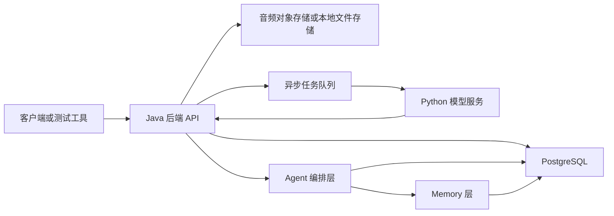

# Chrono Agent MVP 设计规格

## 背景

Chrono Agent 是一个类似 Omi 的智能项链 Agent。长期目标是持续记录用户的环境音频和健康信号，理解用户每天的生活上下文，并提供心理和生活上的帮助。

这个 MVP 不依赖真实项链硬件。第一期先用上传音频或流式音频、模拟健康数据、Java 后端和 Python 模型服务验证核心闭环。真实硬件、移动端后台采集、生产级生物特征合规能力放到后续阶段。

## 目标

- 通过 Java 后端接收用户音频事件和健康事件。
- 使用 Python 服务处理语音转写、说话人分离、声纹聚类、情绪和压力信号分析、总结和建议生成。
- 支持账号内的匿名说话人聚类，用于分析未注册人物。
- 支持用户后续对说话人进行标注、改名、合并、拆分和删除。
- 提供 Agent 会话层、消息存储和 memory 层，用于多轮对话、长期上下文召回和可审计的记忆写入。
- 基于音频、健康数据和用户标注，生成每日总结、主动关怀建议、关系和场景洞察。
- 心理支持保持非临床定位：不诊断、不宣称治疗；出现明显自伤、伤人或严重危机风险时触发危机提示。

## 非目标

- MVP 不做真实硬件固件或蓝牙接入。
- MVP 不做移动端后台录音。
- 不提供医学诊断、心理治疗、药物建议或临床决策。
- 不自动推断旁人的真实姓名、年龄、性别、职业、敏感属性或关系类型。
- 不跨账号共享或匹配声纹。
- 默认不永久保留无限量原始音频。

## 推荐方案

采用 **账号内匿名人物聚类 + 用户后续标注身份**。

未注册人物会先显示为稳定的匿名聚类，例如 `Unknown Person 1`。模型服务可以在相似度足够高时，将后续录音中的说话片段关联到已有匿名聚类。用户之后可以把该聚类标注为“妈妈”“同事张三”或其他自定义名称。历史记录会展示用户提供的标签，同时保留标注和合并记录。

这个方案既能提供长期上下文价值，又不要求周围每个人在被分析前都先注册声纹。它也避免了风险最高的设计：构建跨用户、长期、未经明确同意的真实身份声纹库。

## Omi 参考后的 MVP 优化原则

参考 Omi 公开实现后，Chrono Agent 第一阶段只吸收和“心理与生活个人助手”直接相关的机制：

- **吸收**：会话状态机、会话后处理流水线、低价值录音过滤、会话记录与个人记忆分离、说话人标注建议、实时流降级、加密和删除策略。
- **暂不吸收**：外部数据导入 API、插件市场、复杂任务同步、知识图谱、通用知识库平台、第三方应用生态、独立待办系统、复杂付费额度系统。
- **技术边界不变**：后端仍使用 Java，模型能力仍使用 Python。Omi 的后端实现只作为产品和架构参考，不作为技术栈迁移依据。

## 系统架构

### Java 后端

使用 Spring Boot 构建后端 API。Java 后端负责产品状态、鉴权、持久化、审计日志和面向客户端的 API 合约。

职责：

- 接收音频上传或流式会话片段。
- 接收心率、睡眠、步数、活动量、用户心情打卡等健康事件。
- 持久化原始事件和模型输出。
- 创建异步模型任务。
- 管理说话人聚类、标签、合并、拆分和删除流程。
- 管理 Agent 会话、消息、memory、召回记录和记忆写入审计。
- 暴露时间线、每日总结、主动关怀和人物洞察 API。
- 执行数据保留、删除、访问控制和审计日志策略。

### Python 模型服务

使用 FastAPI 构建模型服务。Python 服务负责模型密集型任务，并以结构化结果返回给 Java 后端。

职责：

- 语音转文字。
- 语音活动检测，用于过滤静音和减少无效转写。
- 说话人分离：识别一段音频中谁在什么时间说话。
- 声纹向量提取。
- 在账号范围内进行声纹匹配。
- 匿名说话人聚类。
- 语言检测和基础多语言支持。
- 情绪、压力和对话信号提取。
- 总结和建议生成。
- 对话生成和候选个人记忆抽取。
- 危机风险初筛，用于升级提示。

Python 服务应尽量保持无状态。持久化状态、身份决策和审计日志由 Java 与 PostgreSQL 负责。模型服务内部应使用 provider adapter，先定义稳定接口，再接真实模型，避免把 Java 后端绑定到某个 STT、声纹或 LLM 供应商。

### Agent 会话和 Memory 层

Agent 会话层运行在 Java 后端内，负责把用户消息、时间线、人物上下文、健康数据和个人记忆组合成可控的模型上下文。Python 模型服务可以生成回复和候选个人记忆，但不能直接写入个人记忆。

Agent 编排层职责：

- 创建和恢复用户会话。
- 持久化用户消息、助手消息、系统事件和模型调用结果。
- 构造当前轮对话上下文。
- 从 timeline、speaker、health 和 memory 中召回相关证据。
- 调用 Python 模型服务生成回复、摘要和候选个人记忆。
- 在回复前后执行安全策略检查。
- 写入助手消息、候选个人记忆、召回记录和审计日志。

### 会话后处理流水线

参考 Omi 的 Conversations 处理方式，Chrono Agent 不应在音频上传后立即写个人记忆。所有录音和对话先进入会话后处理流水线：

1. **暂存会话**：音频或文本进入后，Java 创建 `conversation_memory` 草稿，状态为 `in_progress`。
2. **转写与分段**：Python 返回转写片段、说话人片段、语言和置信度。
3. **低价值过滤**：对空白、太短、噪声、重复或明显无意义的录音标记为 `discarded`，不进入个人记忆抽取。
4. **结构化摘要**：生成标题、概览、话题、生活提醒候选、日程线索、人物和健康信号变化。
5. **个人记忆候选**：只从有足够信息密度的会话记录中抽取候选个人记忆。
6. **冲突与重复检查**：候选个人记忆需要与已有个人记忆比较，重复则跳过，冲突则进入用户确认或替换流程。
7. **洞察生成**：生成每日总结、人物互动洞察和主动关怀候选。
8. **状态完成**：处理成功后状态为 `completed`；失败时记录原因并允许重试。

会话后处理可以异步执行。Java 负责状态机、任务重试和幂等；Python 负责转写、摘要、抽取和分析。

Memory 设计参考 Omi 的公开结构，但不照搬平台化分层。Omi 的核心思路是：**Conversations 保存对话和结构化摘要，Memories 保存从对话中抽取出的用户事实**。Chrono Agent 第一阶段面向心理和生活个人助手，因此收敛为更容易理解和落地的三层：短期上下文、会话记录、个人记忆。

### 短期上下文

短期上下文是当前会话或当前 Agent run 内临时可用的信息。它用于完成本轮理解、推理和回复，通常不作为长期事实保存；如果其中有值得长期保留的内容，需要经过候选记忆流程写入个人记忆。

短期上下文包含：

- 最近几轮用户消息和助手消息。
- 当前任务状态，例如用户正在复盘今天、准备一次沟通，或询问睡眠和压力。
- 当前时间窗口内刚进入系统的音频片段、健康事件、说话人片段和时间线摘要。
- 本轮召回的会话记录、个人记忆、人物洞察和安全检查结果。
- 本轮模型调用和工具结果。

短期上下文不单独建业务表，只在 `agent_run` 中保留必要的上下文快照或引用，方便调试和审计。

### 会话记录

会话记录对应 Omi 的 Conversations 层，是从一段录音、一次对话或一次用户主动会话中形成的结构化记录。它不是稳定的用户事实，而是可回放、可检索、可再次抽取的证据层。

会话记录包含：

- 音频引用、转写片段、说话人片段、消息列表和时间范围。
- 标题、概览、主要话题、关键片段、相关人物、情绪/压力信号和健康信号变化。
- 生活助手结构化信息，例如待办、提醒、约定、日程候选和下一步建议。
- 检索元数据，例如 topic tags、speaker refs、health refs、embedding ref 和关键词。

### 个人记忆

个人记忆对应 Omi 的 Memories 层，是从会话记录、用户消息、健康事件和用户手动输入中抽取出的可跨会话召回的信息。它只保存对心理陪伴和生活助手有长期价值的内容，必须带证据来源、置信度、保留策略和删除能力。

个人记忆按写入来源分为：

- **用户确认记忆**：用户主动创建、编辑或确认的信息，优先级最高。
- **系统记忆**：系统根据明确产品行为生成的信息，例如人物标注、隐私设置、设备设置或 onboarding 选择。
- **自动候选记忆**：模型认为可能有长期价值的信息。敏感内容默认需要用户确认，不能静默写入。

个人记忆按内容类型分为：

- **偏好和目标**：用户希望被如何提醒、近期目标、生活习惯和支持方式偏好。
- **生活模式**：睡眠、压力、精力、活动、工作节奏和常见触发因素。
- **关系上下文**：用户确认的人物标签、关系备注、互动边界和沟通偏好。
- **支持策略**：对用户有效或无效的安抚方式、复盘方式和行动建议风格。
- **安全备注**：与危机、强烈负面状态或风险升级相关的记录。只能用于安全护栏和后续关怀，不能用于夸大判断或替代专业帮助。

检索索引不是独立记忆层，只是实现细节。MVP 使用阿里云 DashVector 作为召回索引，索引内容来自 PostgreSQL 中的会话记录、个人记忆、健康事件和人物洞察。Agent 回复必须优先基于带证据的会话记录和个人记忆，不能只基于索引摘要得出高风险结论。

## 数据流

1. 客户端上传音频文件，或打开一个流式录音会话。
2. Java 保存原始音频对象，并创建 `audio_event`。
3. Java 创建模型处理任务，任务中包含音频对象位置和账号上下文。
4. Python 完成语音转写、说话人分离、声纹向量提取，并返回说话片段。
5. Java 写入 `speaker_segment`，并匹配或创建 `speaker_cluster`。
6. Python 或 Java 生成摘要、话题提示、情绪/压力信号和危机风险标记。
7. Java 将音频分析结果与健康事件组合，生成 `conversation_memory` 和时间线条目。
8. Agent 从会话记录中抽取候选个人记忆、生活提醒和人物洞察。
9. 用户之后可以标注匿名人物；历史洞察展示新的用户标签，但不丢失来源记录。

## 实时音频接入策略

MVP 支持两种音频入口：

- **文件上传**：用于最早期验证和测试，客户端通过 `POST /api/audio` 上传完整音频。
- **流式会话**：用于模拟智能项链实时记录，客户端通过 WebSocket 或分片上传发送短音频片段。

当前本地 Demo 已落地的入口：

- 文件上传：`POST /api/demo/audio`。
- 浏览器录音后上传：前端通过 `MediaRecorder` 录完后调用 `/api/demo/audio`。
- WebSocket 音频片段流：`WS /ws/audio?userId=`，后端使用 Spring WebSocket 接收二进制片段，收到 `stop` 后合并处理。

流式会话要求：

- Java 为每个用户同一时间只允许一个活跃录音会话，避免重复流导致数据混乱。
- 每个流式会话需要记录 `stream_session_id`、采样率、编码格式、来源设备、开始时间、最后活跃时间和状态。
- Java 可以先把音频片段落本地文件或对象存储，再异步发送给 Python 转写。
- Python 模型服务应支持按片段返回增量转写，也支持会话结束后做一次完整后处理。
- 如果 Python 转写或声纹服务暂时不可用，Java 仍保留原始音频和会话状态，后续可重试。
- 对长时间静音、断连和超时的会话，Java 应自动关闭并进入后处理。

Omi 的实时管线中有 pusher、STT provider、VAD gate 和重连状态机。Chrono Agent MVP 不照搬这些子服务，也不开放外部数据导入 API；第一期只保留本产品内部的实时接入、异步处理、断连重试、降级保存和状态可见。

## Agent 会话数据流

1. 用户发起一次会话消息，例如文字提问、语音转写后的提问，或点击每日总结。
2. Java 创建或恢复 `conversation_session`，写入用户侧 `agent_message`。
3. Agent 编排层根据消息意图选择上下文范围，例如最近 24 小时、某个说话人、某段健康数据或当前会话。
4. Memory 层召回相关 `conversation_memory`、`memory_item`、时间线事件、人物洞察和最近消息，并写入 `memory_recall_event`。
5. Java 调用 Python 模型服务生成回复，同时传入经过裁剪和脱敏的上下文。
6. Java 执行输出安全检查，必要时替换为危机处理或保守回复。
7. Java 写入助手侧 `agent_message`。
8. Python 或 Java 生成候选个人记忆和生活提醒，Java 根据来源、类型、置信度和用户设置决定自动写入、等待用户确认或丢弃。
9. 所有个人记忆都保留证据引用，支持查看来源、编辑和删除。

## 核心领域模型

### 与 Omi 核心模型的对应关系

核心领域模型参考了 Omi 的公开实现，但按 Chrono Agent 的 Java 后端和 Python 模型服务边界重新命名和收敛。

映射关系：

- Omi `Conversation` -> Chrono `Conversation Memory`
  - 保留会话来源、时间范围、结构化摘要、转写片段、说话人引用、状态、可见性和低价值丢弃能力。
- Omi `TranscriptSegment` -> Chrono `Speaker Segment`
  - 保留文本、说话人编号、是否用户本人、人物引用、起止时间和语言信息。
- Omi `Memory` / `MemoryDB` -> Chrono `Memory Item`
  - 保留个人事实、来源类型、标签/类型、证据引用、用户确认、编辑删除和生命周期管理。
- Omi `Structured` -> Chrono `Conversation Memory` 的结构化字段
  - 保留标题、概览、类别、生活提醒候选和日程线索，但 MVP 不拆出独立待办/日程系统。
- Omi speech profile / speaker sample -> Chrono `Speaker Cluster`、`Speaker Embedding`、`Speaker Label Suggestion`
  - 保留“用户确认后再强化识别”的思路，未确认身份只作为标签建议。

未纳入 MVP 的 Omi 模型能力：

- 插件/应用市场模型。
- 独立 action item 数据库和任务同步。
- 知识图谱。
- 复杂付费、额度和 persona 体系。
- 第三方导入 API。

### User

表示产品账号。

关键字段：

- `id`
- `timezone`
- `created_at`
- `privacy_settings`

### Audio Event

表示一次上传文件、流式会话或处理后的录音窗口。

关键字段：

- `id`
- `user_id`
- `source_type`
- `started_at`
- `ended_at`
- `audio_uri`
- `processing_status`
- `stream_session_id`
- `sample_rate`
- `codec`
- `retention_expires_at`

### Audio Stream Session

表示一次实时录音连接或分片上传会话。

关键字段：

- `id`
- `user_id`
- `device_id`
- `source_type`
- `sample_rate`
- `codec`
- `started_at`
- `last_active_at`
- `closed_at`
- `status`
- `close_reason`
- `current_audio_event_id`

`status` 可取值：

- `active`
- `closing`
- `closed`
- `failed`
- `timeout`

### Health Event

表示带时间戳的健康或生活数据。

关键字段：

- `id`
- `user_id`
- `event_type`
- `measured_at`
- `value`
- `unit`
- `source`

初始事件类型：

- `heart_rate`
- `sleep_duration`
- `steps`
- `activity_minutes`
- `stress_score`
- `mood_check_in`

### Speaker Segment

表示音频事件中的一段说话片段。

关键字段：

- `id`
- `audio_event_id`
- `speaker_cluster_id`
- `speaker_id`
- `is_user`
- `person_id`
- `start_ms`
- `end_ms`
- `transcript`
- `language`
- `confidence`
- `emotion_tags`
- `topic_tags`

`speaker_id` 是单段音频内的说话人编号，`speaker_cluster_id` 是跨会话聚类后的匿名或已标注人物。`is_user` 用于标记是否用户本人，`person_id` 仅在用户确认身份后写入。

### Speaker Cluster

表示账号内的匿名或已标注说话人聚类。

关键字段：

- `id`
- `user_id`
- `display_name`
- `status`
- `created_from`
- `first_seen_at`
- `last_seen_at`
- `match_confidence_summary`
- `user_labeled`
- `label_suggestion`
- `label_suggestion_source`
- `label_suggestion_confidence`
- `deleted_at`

状态值：

- `unknown`
- `labeled`
- `merged`
- `split`
- `deleted`

### Speaker Embedding

表示从音频中提取的声纹向量。

关键字段：

- `id`
- `speaker_cluster_id`
- `embedding_ref`
- `model_name`
- `created_at`
- `expires_at`

声纹向量必须加密存储。它只能在账号内使用，不能用于跨账号匹配。

### Person Label History

记录用户对说话人身份的编辑。

关键字段：

- `id`
- `speaker_cluster_id`
- `user_id`
- `action`
- `old_value`
- `new_value`
- `reason`
- `created_at`

动作类型：

- `label`
- `rename`
- `merge`
- `split`
- `delete`
- `restore`

### Person Insight

存储围绕匿名或已标注人物生成的 Agent 洞察。

关键字段：

- `id`
- `user_id`
- `speaker_cluster_id`
- `insight_type`
- `time_window_start`
- `time_window_end`
- `summary`
- `evidence_refs`
- `confidence`
- `safety_level`
- `created_at`

### Conversation Memory

表示一次录音、一次对话或一次 Agent 会话沉淀下来的结构化会话记录。它对应 Omi 的 Conversations 层，是个人记忆抽取和检索的主证据来源。

关键字段：

- `id`
- `user_id`
- `source_type`
- `source_audio_event_id`
- `source_conversation_session_id`
- `started_at`
- `ended_at`
- `title`
- `overview`
- `language`
- `category`
- `status`
- `post_processing_status`
- `processing_attempts`
- `last_error_type`
- `last_error_message`
- `discarded`
- `discard_reason`
- `visibility`
- `transcript_ref`
- `speaker_refs`
- `health_refs`
- `topic_tags`
- `emotion_tags`
- `suggested_actions`
- `suggested_events`
- `embedding_ref`
- `created_at`
- `updated_at`
- `deleted_at`

`source_type` 可取值：

- `audio_recording`
- `agent_chat`
- `daily_summary`
- `manual_note`

`status` 可取值：

- `in_progress`
- `processing`
- `completed`
- `failed`
- `discarded`

`post_processing_status` 可取值：

- `not_started`
- `in_progress`
- `completed`
- `canceled`
- `failed`

`visibility` MVP 默认只有 `private`。后续如需分享或公开，再扩展为 `shared` 或 `public`。

`suggested_actions` 和 `suggested_events` 只保存生活助手候选信息，例如提醒、待办、约定和日程线索。MVP 不单独建立待办或日程表；如果后续要接日历或任务系统，再拆成独立模块。

低价值会话可以设置 `discarded=true` 和 `discard_reason`，保留最小审计信息，但不进入个人记忆抽取和主动关怀。

### Speaker Label Suggestion

表示系统对匿名说话人的标签建议。它不是确认身份，只能作为用户标注时的候选。

关键字段：

- `id`
- `speaker_cluster_id`
- `suggested_label`
- `source_type`
- `evidence_ref`
- `confidence`
- `status`
- `created_at`
- `decided_at`

`source_type` 可取值：

- `voice_match`
- `self_introduction_text`
- `user_context`

`status` 可取值：

- `pending`
- `accepted`
- `rejected`
- `expired`

如果模型从文本中发现“我是张三”这类自我介绍，只能生成 `self_introduction_text` 标签建议，不能自动把匿名人物改名为张三。

### Conversation Session

表示一次连续的 Agent 会话。

关键字段：

- `id`
- `user_id`
- `title`
- `session_type`
- `started_at`
- `last_message_at`
- `status`
- `source`

会话类型：

- `chat`
- `daily_summary`
- `check_in`
- `person_review`
- `crisis_follow_up`

### Agent Message

表示会话中的一条消息。消息存储是 Agent 的主事实来源之一，不能只依赖模型上下文缓存。

关键字段：

- `id`
- `conversation_session_id`
- `user_id`
- `role`
- `content_type`
- `content`
- `content_ref`
- `source_event_id`
- `model_name`
- `safety_level`
- `created_at`
- `deleted_at`

角色：

- `user`
- `assistant`
- `system`
- `tool`

内容类型：

- `text`
- `audio_transcript`
- `summary`
- `tool_result`
- `safety_notice`

`content` 保存文本内容。较大的音频、附件或模型原始结果使用 `content_ref` 指向对象存储或结构化结果表。

### Agent Run

表示一次 Agent 生成过程，便于调试、重试和审计。

关键字段：

- `id`
- `conversation_session_id`
- `trigger_message_id`
- `status`
- `context_window_start`
- `context_window_end`
- `short_term_memory_ref`
- `retrieved_context_ref`
- `model_request_ref`
- `model_response_ref`
- `safety_result`
- `created_at`
- `completed_at`

`short_term_memory_ref` 保存本轮短期上下文快照或摘要引用，用于复现 Agent 当时看到的上下文。`retrieved_context_ref` 保存本轮召回的会话记录、个人记忆、人物洞察和时间线证据引用。

### Memory Item

表示 Agent 可以跨会话召回的一条个人记忆。它对应 Omi 的 Memories 层，通常来自 `conversation_memory`、用户消息、健康事件或用户手动输入。

关键字段：

- `id`
- `user_id`
- `source_type`
- `memory_type`
- `scope`
- `subject_type`
- `subject_id`
- `content`
- `confidence`
- `source`
- `evidence_refs`
- `created_at`
- `updated_at`
- `valid_at`
- `invalid_at`
- `superseded_by`
- `last_used_at`
- `expires_at`
- `deleted_at`

个人记忆来源：

- `user_confirmed`
- `system_generated`
- `model_suggested`

个人记忆类型：

- `preference_goal`
- `life_pattern`
- `relationship_context`
- `support_strategy`
- `safety_note`

`evidence_refs` 必须能指回消息、音频片段、健康事件、人物洞察或用户手动确认记录。

个人记忆默认只召回 `invalid_at = null` 且 `deleted_at = null` 的记录。当新记忆修正、合并或替代旧记忆时，旧记忆不应直接物理删除，而是设置 `invalid_at` 和 `superseded_by`，保留历史和审计能力。

### Memory Recall Event

记录某次 Agent 生成时召回了哪些会话记录、个人记忆和证据。

关键字段：

- `id`
- `agent_run_id`
- `recall_type`
- `memory_item_id`
- `conversation_memory_id`
- `rank`
- `reason`
- `score`
- `created_at`

### Memory Write Candidate

表示模型或规则从会话记录、用户消息或健康事件中抽取出的候选个人记忆。

关键字段：

- `id`
- `conversation_session_id`
- `conversation_memory_id`
- `source_message_id`
- `source_type`
- `memory_type`
- `content`
- `confidence`
- `decision`
- `decision_reason`
- `created_at`
- `decided_at`

候选记忆决策：

- `auto_saved`
- `needs_user_confirmation`
- `discarded`
- `user_rejected`

## API 设计

### 音频

- `POST /api/audio`
  - 上传音频文件。
  - 返回 `audio_event_id` 和处理状态。

- `GET /api/audio/{audioEventId}`
  - 返回处理状态和基础元数据。

- `WS /api/audio/stream`
  - 创建流式音频会话，接收实时音频片段并返回增量状态。

- `POST /api/audio/stream/{streamSessionId}/chunks`
  - HTTP 分片上传音频，用于测试环境或不支持 WebSocket 的客户端。

- `POST /api/audio/stream/{streamSessionId}/close`
  - 关闭流式音频会话，并触发会话后处理。

### 健康事件

- `POST /api/health-events`
  - 写入一个或多个健康事件。

- `GET /api/health-events`
  - 按时间范围和事件类型查询健康事件。

### 时间线

- `GET /api/timeline`
  - 返回指定时间范围内的音频片段、健康事件、总结和洞察。

### Agent

- `POST /api/agent/check-in`
  - 基于最近时间线数据和可选用户文本生成一次上下文回应。

- `GET /api/agent/daily-summary`
  - 返回每日总结，包括心情、压力、活动、对话和建议行动。

### 会话和消息

- `POST /api/conversations`
  - 创建一次 Agent 会话。

- `GET /api/conversations`
  - 查询用户会话列表。

- `GET /api/conversations/{conversationId}`
  - 查询会话详情和消息列表。

- `POST /api/conversations/{conversationId}/messages`
  - 向会话发送一条用户消息，并触发 Agent 回复。

- `DELETE /api/conversations/{conversationId}/messages/{messageId}`
  - 删除或软删除单条消息，并触发相关 memory 重新校验。

### Memory

- `GET /api/conversation-memories`
  - 按时间、人物、话题或关键词查询会话记录。

- `GET /api/conversation-memories/{conversationMemoryId}`
  - 查询会话记录详情，包括摘要、转写引用、相关说话人、生活提醒和日程线索。

- `POST /api/conversation-memories/{conversationMemoryId}/reprocess`
  - 重新执行会话后处理，用于模型失败、用户修正转写或规则升级后的重算。

- `GET /api/memories`
  - 按来源、类型、人物、时间范围或关键词查询个人记忆。

- `PATCH /api/memories/{memoryId}`
  - 编辑个人记忆内容、过期时间或可用范围。

- `DELETE /api/memories/{memoryId}`
  - 删除一条个人记忆，并记录审计日志。

- `GET /api/memory-candidates`
  - 查询等待用户确认的候选个人记忆。

- `POST /api/memory-candidates/{candidateId}/decision`
  - 接受或拒绝候选个人记忆。

### 说话人

- `GET /api/speakers`
  - 查询匿名和已标注说话人聚类。

- `GET /api/speakers/{speakerClusterId}`
  - 查询某个说话人聚类的详情、近期互动和相关洞察。

- `PATCH /api/speakers/{speakerClusterId}`
  - 改名或标注某个聚类。

- `POST /api/speakers/{speakerClusterId}/merge`
  - 将另一个聚类合并到当前聚类。

- `POST /api/speakers/{speakerClusterId}/split`
  - 将选中的说话片段拆分成新的聚类。

- `DELETE /api/speakers/{speakerClusterId}`
  - 按保留策略删除聚类标签、声纹向量和派生人物洞察。

- `GET /api/speaker-label-suggestions`
  - 查询待处理的说话人标签建议。

- `POST /api/speaker-label-suggestions/{suggestionId}/decision`
  - 接受或拒绝某个标签建议。

## Agent 能力

### 每日复盘

Agent 总结：

- 当天主要话题。
- 精力较高和较低的时间段。
- 从语言、声音和健康事件中推断出的压力或平静信号。
- 重复出现的互动模式。
- 一到三条实际可执行的下一步建议。

### 主动关怀

Agent 基于近期上下文回应用户问题。

示例：

- “我今天为什么这么累？”
- “帮我总结今天和 Unknown Person 2 的沟通。”
- “最近我和妈妈聊天后的状态怎么样？”

### 多轮会话

Agent 支持围绕同一个主题持续对话。每次回复都应明确基于当前会话消息、召回的 memory 和相关时间线证据生成。

要求：

- 用户可以查看历史会话和消息。
- 用户可以删除消息；删除后，与该消息唯一相关的 memory 需要删除或降级。
- 模型不能把未持久化的上下文当作个人事实。
- 跨会话使用的个人事实必须写入 `memory_item`，并带证据来源。
- 敏感 memory 默认更保守，必要时需要用户确认。

### 召回和生成安全限制

参考 Omi 的 agentic retrieval 安全护栏，Chrono Agent 的 Agent 生成需要设置明确边界：

- 每次 Agent run 设置最大召回条数，避免把过多历史塞进上下文。
- 每次 Agent run 设置最大模型调用次数和最大工具调用次数。
- 对重复检索同一条件的行为做循环检测。
- 对上下文长度做硬限制，超过限制时缩小时间范围或让用户澄清问题。
- 心理和安全相关问题优先召回 `safety_note`、最近会话记录和用户确认的支持策略。
- 输出中涉及人物关系、压力原因或心理状态时，必须带不确定性表达，不能把相关性说成因果。

### 个人记忆

Agent 可以使用个人记忆提供更个性化的心理和生活建议。

允许写入：

- 用户明确表达的偏好、目标和习惯。
- 用户确认过的人物标签和关系备注。
- 反复出现的生活模式，例如睡眠不足后更容易焦虑。
- 对用户有效或无效的支持策略。
- 与健康、情绪和互动相关的非诊断性观察。

写入规则：

- `user_confirmed` 记忆来自用户主动创建或确认，优先级最高。
- `system_generated` 记忆来自明确系统事件，例如人物标注、设置变更或 onboarding 选择。
- `model_suggested` 记忆来自模型自动抽取，必须有证据引用、置信度和安全策略；敏感内容默认进入确认队列。

禁止写入或需要用户确认：

- 未经用户确认的敏感身份信息。
- 对旁人的真实身份推断。
- 缺乏证据的心理判断。
- 可造成伤害的定性标签，例如“某人一定在操控你”。

### 周围人物分析

Agent 可以分析匿名和已标注说话人聚类。

允许输出：

- 互动频率和互动时长。
- 对话主题。
- 与某个聚类互动前后，用户健康或心情信号是否变化。
- 某个聚类最近是否更频繁出现。
- 用户自己提供的人物标签和关系备注。
- 温和建议，例如为某次沟通做准备、密集会议后休息、向可信任的人寻求支持。

禁止输出：

- 在用户标注前自动识别真实世界中的某个人。
- 推断年龄、性别、种族、宗教、健康状态、政治观点、性取向等敏感属性。
- 对周围人物做指控、法律结论或临床判断。
- 在缺乏用户语境和安全约束的情况下，把某个人直接判定为有害、有毒、危险或虐待性人物。

### 危机处理

当用户表达自伤、伤人、急性危机或无法保证安全时，Agent 必须：

- 不把普通心理疏导作为主要回应。
- 鼓励用户立即联系本地紧急帮助。
- 在可用时展示当地危机干预资源。
- 鼓励联系可信任的人。
- 记录安全事件，供审计和后续产品复盘。

美国地区可以展示 988 Lifeline 资源。其他地区需要单独配置资源。

## 隐私和安全要求

声纹属于敏感生物特征数据。MVP 必须把声纹向量和原始音频当作高风险数据处理。

要求：

- 提供用户可见的开关，用于启用或禁用说话人聚类。
- 明确提示周围声音可能会被处理成匿名人物聚类。
- 只允许账号内匹配。
- 禁止跨用户或全局声纹身份搜索。
- 音频和声纹向量必须加密存储。
- 提供删除 API，用于删除原始音频、声纹向量、标签、片段和派生洞察。
- 提供会话、消息和 memory 删除能力；删除源消息时必须处理依赖该消息的 memory。
- 为原始音频和声纹向量设置保留策略。
- 对标注、合并、拆分、删除、导出说话人数据等操作记录审计日志。
- 对 memory 写入、编辑、删除、召回和候选决策记录审计日志。
- 所有日志必须避免输出原始转写、完整个人记忆、声纹向量和健康明细；调试日志只能记录 ID、状态、置信度和脱敏摘要。
- 会话记录、消息、个人记忆、原始音频和声纹向量需要支持加密存储；MVP 可先定义加密接口，开发环境使用本地密钥。
- 写入会话记录、个人记忆和标签建议时必须支持幂等键，避免重试产生重复记忆或重复提醒。
- 保留置信度，供内部调试和问题排查使用。
- 对聚类创建和声纹匹配使用保守阈值。
- 提供人工纠错流程，处理错误聚类。

合规备注：

- 声纹和说话人向量在部分地区可能被作为生物特征标识监管。
- MVP 不能把匿名说话人聚类本身包装成法律合规方案。
- 面向真实用户部署前，产品、法务和安全团队需要定义通知、同意、保留、删除、导出和地区可用性规则。
- 如果产品会存储旁人的声音，用户体验中必须让账号用户明确知道周围声音会被处理，并提供关闭聚类的控制项。

## 错误处理

- 音频上传失败时返回可重试错误，不创建已处理事件。
- 模型任务失败时，将 `audio_event` 标记为 `failed`，并在保留期内保留原始事件以便重试。
- 会话后处理失败时，将 `conversation_memory.status` 标记为 `failed`，保留失败原因、重试次数和最后一次错误类型。
- 重试会话后处理必须幂等：同一会话的旧候选个人记忆和生活提醒需要被替换、失效或关联到同一处理版本。
- 说话人分离置信度低时，创建未分配片段，而不是强行归入某个聚类。
- 声纹匹配置信度低时，根据阈值创建新的匿名聚类，或保持片段未匹配。
- Agent 生成失败时返回兜底消息，并记录失败的模型任务。
- OpenRouter 或 DashVector 不可用时，本轮 Agent 回复返回失败，不能生成固定模板回复。
- 候选个人记忆置信度不足时不得自动写入，只能丢弃或等待用户确认。
- 说话人合并和拆分操作应尽量通过标签历史支持回溯。

## 可观测性和运营指标

MVP 需要为核心链路保留最小可观测性，方便定位“记不住”“乱记”“漏转写”“人物识别错”等问题。

关键指标：

- 音频上传成功率、流式会话断连率、平均录音时长。
- 转写任务成功率、平均处理时延、失败原因分布。
- 会话后处理成功率、低价值会话丢弃率、重试次数。
- 个人记忆候选数量、确认率、拒绝率、删除率。
- 说话人聚类数量、标签建议接受率、合并/拆分次数。
- Agent 回复失败率、召回降级次数、安全升级次数。

所有指标不得包含原文转写、完整消息、声纹向量或健康明细。

## MVP 技术选择

### 后端

- Java 21
- Spring Boot
- Maven
- Spring WebSocket
- PostgreSQL
- Spring Data JPA 作为基础持久化能力，Demo pipeline 可使用 `JdbcTemplate` 精确写入多表链路
- Java 调 Python 模型服务使用 `RestTemplate` + `fastjson2`
- 开发环境先使用本地文件系统保存音频，并通过对象存储接口做抽象

### 模型服务

- Python 3.11+
- FastAPI
- MVP 集成测试先使用本地占位模型适配器
- 为转写、说话人分离、声纹向量、情绪分析、总结和建议生成提供可替换适配器

本设计阶段不选择新的生产模型依赖。实现应先建立适配器接口和确定性的测试替身，等 API 合约稳定后再接入真实模型。

## 测试策略

### Java 后端

- 为说话人标注、合并、拆分和删除规则写单元测试。
- 为音频上传、流式会话、分片上传、健康事件写入、时间线查询和 Agent 接口写 API 测试。
- 为会话创建、消息写入、消息删除和 Agent run 状态写 API 测试。
- 为会话后处理状态机、低价值会话丢弃、失败重试和重处理写测试。
- 为会话记录创建、结构化摘要、生活提醒候选写 API 测试和持久化测试。
- 为个人记忆写入、召回、编辑、删除和候选确认写单元测试与持久化测试。
- 为说话人标签建议接受/拒绝写 API 测试。
- 为数据保留、审计日志创建、说话人数据删除写持久化测试。

### Python 模型服务

- 为语音活动检测、转写、说话人分离、声纹向量、结构化摘要、候选个人记忆和洞察返回结构写契约测试。
- 使用确定性的假模型做本地开发测试。
- 为聚类匹配阈值行为写测试。

### 端到端

- 上传样例音频。
- 使用 WebSocket 模拟一次流式录音会话，并正常关闭。
- 写入模拟心率和睡眠数据。
- 处理转写结果和匿名说话人聚类。
- 将低价值空白录音标记为 discarded，并验证不生成个人记忆。
- 标注一个未知说话人。
- 从自我介绍文本生成说话人标签建议，用户接受后更新聚类标签。
- 发送一条 Agent 会话消息，并验证用户消息、助手消息和 Agent run 被持久化。
- 从音频或会话中生成 `conversation_memory`。
- 从会话记录中生成候选个人记忆和生活提醒。
- 确认候选个人记忆后写入 `memory_item`。
- 再次提问时召回会话记录和个人记忆，并记录 `memory_recall_event`。
- 生成每日总结和人物洞察。
- 删除该说话人聚类，并验证派生数据被删除或匿名化。

## 实现阶段

### 阶段 1：项目骨架和接口合约

- 创建 Java 后端项目。
- 创建 Python 模型服务项目。
- 定义共享 API schema。
- 添加本地开发配置。

### 阶段 2：数据接入

- 实现音频上传。
- 实现流式音频会话和 HTTP 分片上传。
- 实现健康事件写入。
- 实现时间线 API。
- 添加持久化和基础测试。

### 阶段 3：模型任务流水线

- 添加异步任务流程。
- 添加 Python 假模型接口。
- 存储转写、说话人分离和初始洞察。
- 添加会话后处理状态机、低价值会话过滤、失败重试和重处理入口。

### 阶段 4：Agent 会话、消息和 Memory

- 添加会话和消息表。
- 添加 Agent run 记录。
- 添加 conversation memory。
- 添加 memory item、memory recall event 和 memory write candidate。
- 添加会话消息 API、会话记录 API 和个人记忆 API。
- 添加基于假模型的多轮会话流程。

### 阶段 5：说话人聚类和标注

- 添加说话人聚类和声纹向量。
- 添加匿名聚类匹配。
- 添加说话人标签建议，包括声纹匹配建议和自我介绍文本建议。
- 添加标注、改名、合并、拆分和删除 API。
- 添加审计日志。

### 阶段 6：Agent 体验

- 添加主动关怀接口。
- 添加每日总结接口。
- 添加人物洞察生成。
- 添加危机处理护栏。

### 阶段 7：加固

- 添加数据保留任务。
- 添加音频和声纹向量安全控制。
- 添加消息和 memory 删除、导出、保留策略。
- 添加幂等键、日志脱敏、核心指标和失败重试仪表盘。
- 添加端到端测试。
- 编写人工验证步骤。

## 当前已确认的实现决策

- Java 后端使用 Maven、Java 21 和 Spring Boot。
- 本地开发使用 Docker Compose 启动 PostgreSQL 16。
- 持久化基础能力使用 Spring Data JPA；Demo 聚合写入使用 `JdbcTemplate`。
- 模型服务第一阶段音频分析使用 Python FastAPI fake provider，并通过 provider adapter 预留真实 ASR、声纹模型替换。
- Agent 回复使用 OpenRouter NVIDIA Nemotron 3 Nano Omni，默认模型 ID 为 `nvidia/nemotron-3-nano-omni-30b-a3b-reasoning:free`。
- Agent 召回使用 OpenRouter `nvidia/llama-nemotron-embed-vl-1b-v2:free` 生成文本向量，并使用阿里云 DashVector 检索。
- Java 调 Python 使用 `RestTemplate` + `fastjson2`，模型接口 JSON 字段名使用 snake_case。
- 本地 Demo 优先支持文件上传、浏览器录音上传和 WebSocket 音频片段流；生产级 HTTP 分片可保留为后续扩展。
- 当前版本不做外部数据接入。
- 音频先使用本地文件系统存储。
- 用户隔离先使用 `userId`。
- 声纹识别只做账号内匿名聚类，不跨账号匹配。
- 原始音频默认保留 30 天，保留策略必须配置化。
- 敏感候选记忆是否自动写入需要支持用户个人配置。
- 第一阶段不自建向量数据库；召回索引使用阿里云 DashVector，PostgreSQL 仍是唯一可信业务数据源。

## 参考资料

- Omi GitHub repository: https://github.com/BasedHardware/omi
- Omi documentation, Chat System: https://docs.omi.me/doc/developer/backend/chat_system
- Omi documentation, Storing Conversations & Memories: https://docs.omi.me/doc/developer/backend/StoringConversations
- Omi documentation, Listen + Pusher Pipeline: https://docs.omi.me/doc/developer/backend/listen_pusher_pipeline
- Omi Developer API, Memories: https://docs.omi.me/doc/developer/api/memories
- Omi API reference, Create Memory: https://docs.omi.me/api-reference/endpoint/memories/create
- WHO digital health topic page: https://www.who.int/health-topics/digital-health
- WHO mental health fact sheet: https://www.who.int/news-room/fact-sheets/detail/mental-health-strengthening-our-response
- 988 Lifeline warning signs: https://988lifeline.org/learn/warning-signs/
- FDA clinical decision support software guidance: https://www.fda.gov/regulatory-information/search-fda-guidance-documents/clinical-decision-support-software
- NIST speaker recognition overview: https://www.nist.gov/itl/iad/mig/speaker-recognition
- FTC biometric information policy statement: https://www.ftc.gov/legal-library/browse/policy-statement-federal-trade-commission-biometric-information-section-5-federal-trade-commission-act
- Illinois Biometric Information Privacy Act: https://www.ilga.gov/legislation/ilcs/ilcs3.asp?ActID=3004&ChapterID=57
