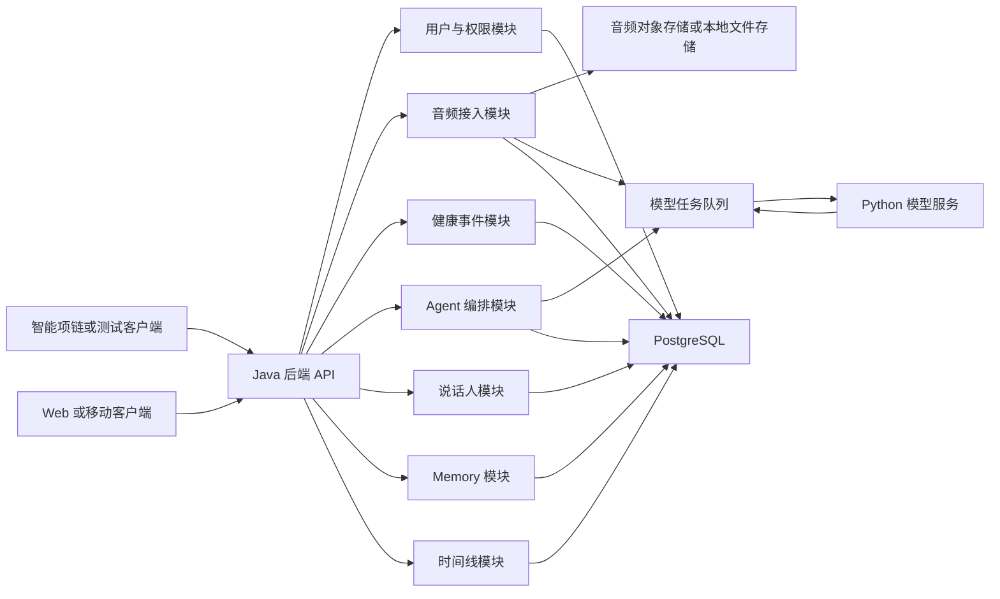
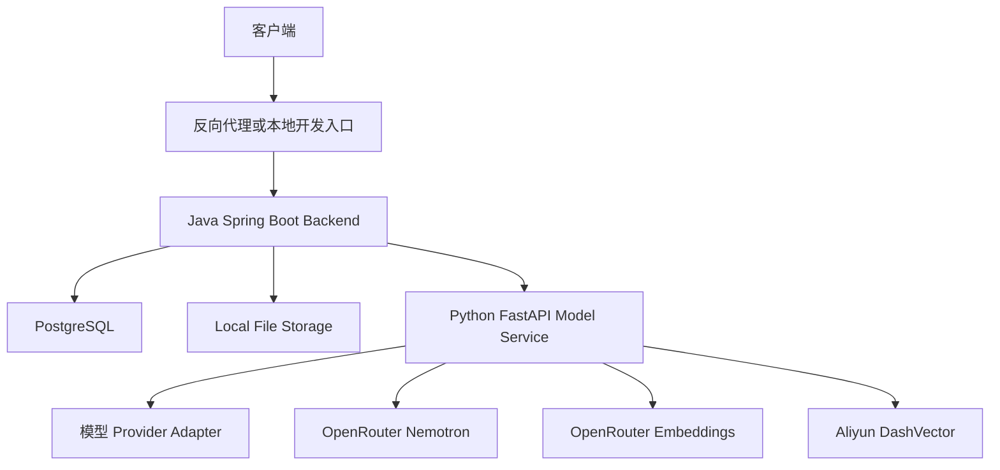
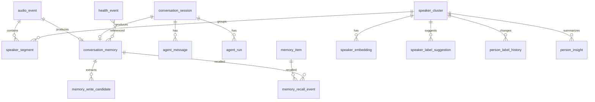
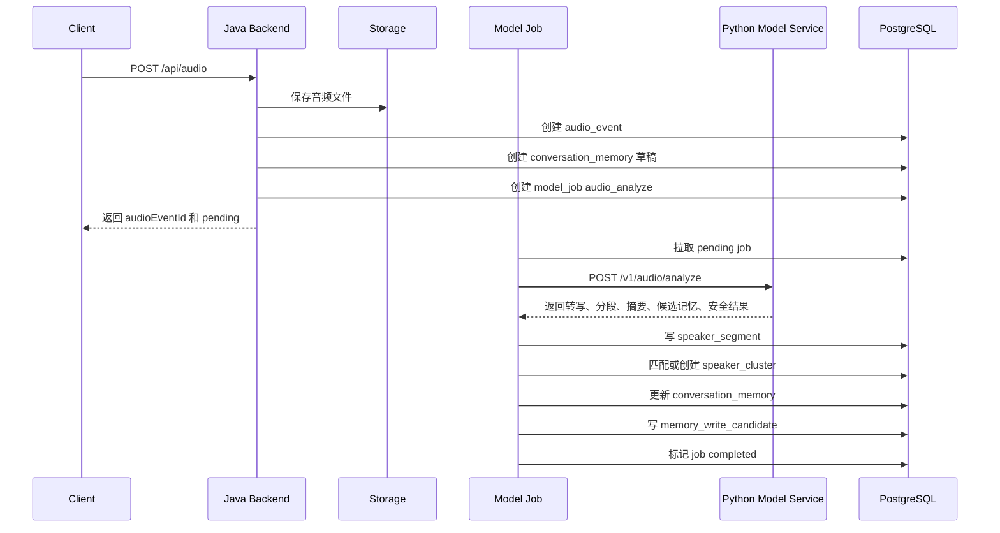
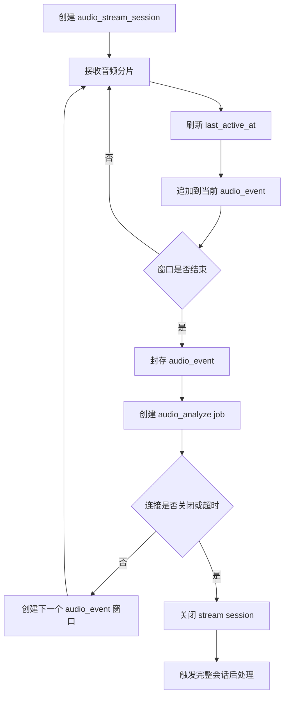
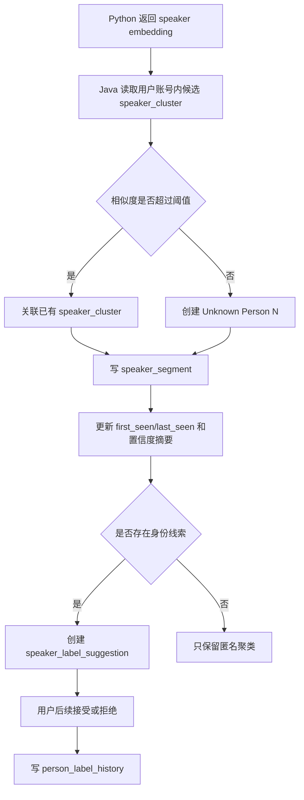
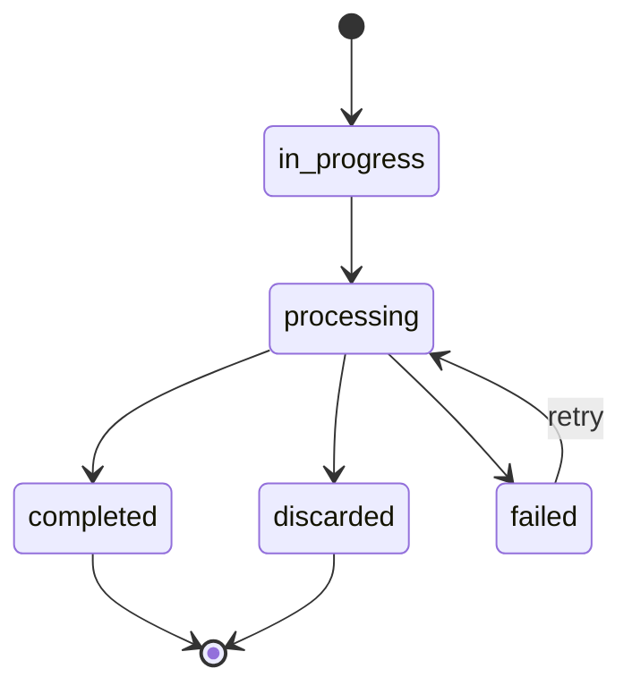
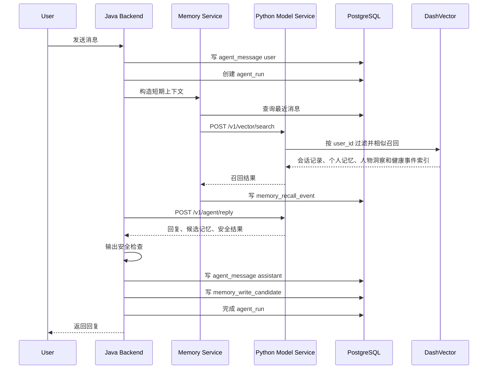
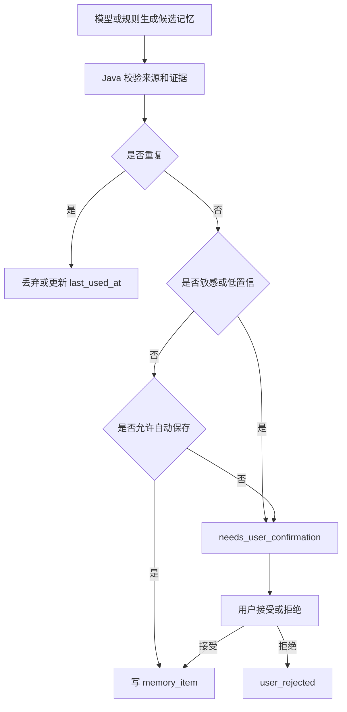

# Chrono Agent 技术方案文档

## 1. 文档目标

本文档描述 Chrono Agent MVP 的技术方案，覆盖系统架构、模块边界、数据库设计、关键业务流程和核心实现细节。

Chrono Agent 是一个面向智能项链场景的个人 Agent。产品目标是持续记录用户授权范围内的音频和健康数据，形成可追溯的生活上下文，并在心理支持和日常生活管理上给用户提供帮助。

本方案遵守以下边界：

- 后端使用 Java。
- 模型能力使用 Python。
- 数据库使用 PostgreSQL。
- 当前版本不做外部数据接入。
- 当前版本不做真实硬件固件、蓝牙协议和移动端后台录音。
- 不提供医学诊断、心理治疗、药物建议或临床决策。
- 不跨账号共享或匹配声纹。
- 未注册人物可以被匿名聚类和分析，但不能自动推断真实身份；用户后续可以自行标注。

## 2. 设计原则

### 2.1 参考 Omi，但不照搬技术栈

Omi 的公开实现对本产品有三点重要参考价值：

- 会话记录和个人记忆分离：录音、转写、摘要先沉淀为 Conversation，再从中抽取长期 Memory。
- 会话后处理流水线：原始音频进入系统后，先经历转写、过滤、摘要、结构化抽取和状态更新，不直接写入长期记忆。
- 说话人标注建议：系统可以提供标签建议，但最终身份应由用户确认。

Chrono Agent 保留这些产品和架构思想，但技术边界重新设计：

- Omi 后端实现不迁移到本项目。
- Java 后端负责产品状态、持久化、审计、Agent 编排和对外 API。
- Python 服务负责语音、声纹、情绪、摘要、记忆候选、文本向量、向量召回和回复生成等模型能力。
- PostgreSQL 作为 MVP 的主存储；阿里云 DashVector 作为 Agent 召回索引，不作为业务事实来源。

### 2.2 个人助手优先

Chrono Agent 第一阶段不是通用知识平台，也不是企业会议系统。功能收敛在两个核心场景：

- 心理支持：情绪复盘、压力观察、温和陪伴、危机风险提示。
- 生活助手：每日总结、睡眠和精力回顾、互动复盘、轻量提醒候选。

因此记忆分层也收敛为三层：

- 短期上下文：当前 Agent run 内可用的临时上下文。
- 会话记录：来自录音、聊天和总结的结构化证据层。
- 个人记忆：可跨会话召回、带证据来源和生命周期管理的长期记忆。

### 2.3 账号内匿名人物聚类

声纹识别只在用户账号范围内运行。未注册人物进入系统时先形成匿名说话人聚类，例如 `Unknown Person 1`。系统可以持续分析这个匿名聚类与用户的互动频率、情绪变化和上下文线索，但不能自动命名或推断敏感属性。

用户可以后续执行：

- 标注身份，例如“妈妈”“同事张三”。
- 修改显示名。
- 合并重复聚类。
- 拆分错误聚类。
- 删除某个聚类及其关联数据。

### 2.4 原始数据可控，记忆可审计

音频、声纹、健康和心理状态数据都属于高敏感数据。系统必须支持：

- 原始音频保留期限。
- 用户删除音频、转写、记忆和人物聚类。
- 个人记忆保留证据来源。
- Agent 每次召回哪些记忆都可审计。
- 日志不打印完整音频转写、心理状态描述、声纹向量和模型原始请求。

## 3. 总体架构

### 3.1 逻辑架构



### 3.2 部署架构

MVP 推荐单体 Java 后端加独立 Python 模型服务。



第一期本地开发可以使用：

- Java 21 + Spring Boot。
- Spring WebSocket 提供浏览器音频流 Demo。
- `RestTemplate` + `fastjson2` 作为 Java 调 Python 的 HTTP JSON 边界。
- Python 3.11+ + FastAPI。
- OpenRouter chat completions 生成 Agent 回复，默认 `nvidia/nemotron-3-nano-omni-30b-a3b-reasoning:free`。
- OpenRouter `nvidia/llama-nemotron-embed-vl-1b-v2:free` 生成文本向量。
- 阿里云 DashVector 保存会话记录、长期记忆、健康事件和人物洞察的召回索引。
- PostgreSQL + Flyway。
- 本地文件系统作为音频对象存储抽象的默认实现。
- Java 内置异步执行器或数据库任务表作为模型任务队列。

生产阶段可以替换：

- 本地文件系统替换为对象存储。
- Java 内置任务替换为 MQ 或工作流引擎。
- Python fake provider 替换为真实 ASR、说话人分离和声纹 provider。
- OpenRouter chat、OpenRouter embedding 和 DashVector provider 通过 adapter 隔离，保留后续替换能力。

### 3.3 服务边界

#### Java 后端职责

Java 后端是产品状态的唯一可信来源。

主要职责：

- 用户、权限和隐私设置。
- 音频上传、流式音频会话、音频文件存储引用。
- 健康事件写入和查询。
- 模型任务创建、重试、状态更新和幂等控制。
- 说话人聚类、标签建议、用户标注、合并、拆分、删除。
- 会话记录、Agent 会话、消息、Agent run、个人记忆和召回审计。
- 每日总结、主动关怀、人物洞察和时间线 API。
- 输出安全检查、危机提示和数据删除。

#### Python 模型服务职责

Python 模型服务是模型能力适配层，尽量保持无状态。

主要职责：

- 音频活动检测。
- 语音转文字。
- 说话人分离。
- 声纹向量提取。
- 情绪和压力信号提取。
- 对话摘要。
- 生活提醒候选和日程线索提取。
- 个人记忆候选抽取。
- Agent 回复生成。
- 文本 embedding 生成。
- DashVector 索引写入和相似召回查询。
- 危机风险初筛。

Python 服务不得直接写 PostgreSQL，也不得直接修改用户记忆和人物身份。所有持久化由 Java 后端完成。

#### PostgreSQL 职责

PostgreSQL 保存结构化产品数据：

- 音频事件元数据。
- 健康事件。
- 说话人片段、匿名聚类和标签历史。
- 会话记录。
- Agent 会话和消息。
- 个人记忆和召回审计。
- 处理任务、错误和审计日志。

Agent 召回使用阿里云 DashVector。PostgreSQL 仍保存完整业务数据和审计记录；DashVector 只保存召回索引文档，字段包括 `user_id`、`source_type`、`source_id`、`content`、`reason` 和 `created_at`。DashVector collection 维度必须与 `CHRONO_EMBEDDING_DIMENSION` 一致，当前默认 `2048`。

## 4. 模块设计

### 4.1 Backend 模块划分

建议 Java 后端按业务能力划分包：

```text
ai.chrono.backend
  common
  user
  audio
  health
  modelclient
  task
  conversation
  speaker
  memory
  agent
  timeline
  safety
  audit
```

各模块职责：

| 模块 | 职责 |
| --- | --- |
| `common` | 通用异常、时间、ID、日志脱敏、响应结构 |
| `user` | 用户、隐私设置、数据保留策略 |
| `audio` | 音频上传、流式会话、音频事件状态 |
| `health` | 健康事件写入和查询 |
| `modelclient` | 调用 Python 模型服务的 HTTP client 和 DTO |
| `task` | 模型任务、重试、幂等和后台执行 |
| `conversation` | 会话记录、后处理状态机和结构化摘要 |
| `speaker` | 说话人片段、聚类、标签建议、用户标注 |
| `memory` | 短期上下文构造、个人记忆、候选记忆、召回审计 |
| `agent` | Agent 会话、消息、run、回复编排 |
| `timeline` | 时间线查询、每日总结和复盘视图 |
| `safety` | 危机风险、输出策略、敏感数据限制 |
| `audit` | 数据访问、删除、标注、记忆写入审计 |

### 4.2 Model Service 模块划分

建议 Python 模型服务按 provider adapter 划分：

```text
model-service/app
  main.py
  schemas.py
  services
    analyze_audio.py
    generate_reply.py
    extract_memory.py
    safety.py
  providers
    asr.py
    diarization.py
    voiceprint.py
    emotion.py
    llm.py
    fake.py
```

音频分析和声纹能力可以先使用 deterministic fake provider，保证端到端链路稳定。Agent 回复使用 OpenRouter 上的 NVIDIA Nemotron 3 Nano Omni；如果 LLM 不可用，Python 返回 502，Java 不生成固定模板回复。真实 ASR、说话人分离和声纹模型接入时只替换 provider，不改变 Java 和 Python 之间的 API contract。

### 4.3 Java 与 Python 的接口边界

Java 调 Python 采用 HTTP JSON API。Java 传入对象引用和上下文摘要，Python 返回结构化结果。

当前实现约定：

- `ModelServiceClient` 使用 Spring `RestTemplate` 发送请求。
- 请求和响应 JSON 使用 `fastjson2` 序列化和反序列化。
- Java DTO 通过 `@JSONField` 显式映射字段名。
- Java/Python 模型接口字段名统一使用 snake_case，与 `model-service/app/schemas.py` 保持一致。
- Spring MVC Demo API 面向前端时仍可以使用 Java 风格字段，例如 `userId`；模型服务边界必须使用 snake_case。

核心接口：

- `POST /v1/audio/analyze`
- `POST /v1/agent/reply`
- `POST /v1/vector/upsert`
- `POST /v1/vector/search`
- `POST /v1/memory/extract`
- `POST /v1/safety/classify`

Python 返回的结果只能是候选或分析结果，不能表达“已经写入长期记忆”“已经确认人物身份”这类产品状态。

## 5. 数据库设计

### 5.1 命名和通用字段

建议数据库采用 snake_case 命名。

通用约定：

- 主键使用 `uuid`。
- 用户隔离字段使用 `user_id varchar(128)`。
- 时间使用 `timestamp with time zone`。
- 枚举先使用 `varchar`，由 Java 枚举和业务校验约束。
- 灵活结构使用 `jsonb`，例如标签、证据引用、模型安全结果。
- 删除优先软删除，字段为 `deleted_at`。
- 个人记忆生命周期使用 `valid_at`、`invalid_at`、`superseded_by`。

### 5.2 核心表关系



### 5.3 表设计总览

| 表名 | 说明 |
| --- | --- |
| `audio_stream_session` | 一次实时录音连接或分片上传会话 |
| `audio_event` | 一段上传音频或流式音频窗口 |
| `health_event` | 心率、睡眠、步数、压力、心情等健康事件 |
| `speaker_segment` | 音频中的一段说话内容 |
| `speaker_cluster` | 账号内匿名或已标注说话人聚类 |
| `speaker_embedding` | 加密声纹向量引用 |
| `speaker_label_suggestion` | 系统生成的身份标签建议 |
| `person_label_history` | 用户对说话人标签的编辑历史 |
| `person_insight` | 围绕某个匿名或已标注人物的洞察 |
| `conversation_memory` | 会话记录，作为证据层 |
| `conversation_session` | 一次 Agent 会话 |
| `agent_message` | Agent 会话中的消息 |
| `agent_run` | 一次 Agent 生成过程 |
| `memory_item` | 长期个人记忆 |
| `memory_write_candidate` | 待确认或自动保存的候选记忆 |
| `memory_recall_event` | Agent run 的记忆召回审计 |
| `model_job` | 模型处理任务 |
| `audit_log` | 敏感数据操作审计 |

### 5.4 音频相关表

#### `audio_stream_session`

用于记录一次实时录音连接。流式接入和 HTTP 分片接入都可以复用该表。

| 字段 | 类型 | 说明 |
| --- | --- | --- |
| `id` | `uuid` | 主键 |
| `user_id` | `varchar(128)` | 用户 ID |
| `device_id` | `varchar(128)` | 设备 ID |
| `source_type` | `varchar(64)` | `necklace`、`mobile`、`test_client` |
| `sample_rate` | `integer` | 采样率 |
| `codec` | `varchar(32)` | 编码格式 |
| `started_at` | `timestamptz` | 开始时间 |
| `last_active_at` | `timestamptz` | 最后活跃时间 |
| `closed_at` | `timestamptz` | 关闭时间 |
| `status` | `varchar(32)` | `active`、`closing`、`closed`、`failed`、`timeout` |
| `close_reason` | `text` | 关闭原因 |
| `current_audio_event_id` | `uuid` | 当前正在写入的音频事件 |
| `created_at` | `timestamptz` | 创建时间 |
| `updated_at` | `timestamptz` | 更新时间 |

关键索引：

```sql
create unique index ux_audio_stream_one_active
on audio_stream_session(user_id)
where status = 'active';

create index idx_audio_stream_user_started
on audio_stream_session(user_id, started_at desc);
```

#### `audio_event`

用于记录一段可处理音频。完整上传是一条 `audio_event`，长流式录音可以按时间窗口切成多条。

| 字段 | 类型 | 说明 |
| --- | --- | --- |
| `id` | `uuid` | 主键 |
| `user_id` | `varchar(128)` | 用户 ID |
| `source_type` | `varchar(64)` | `upload`、`stream_chunk`、`stream_window` |
| `started_at` | `timestamptz` | 音频开始时间 |
| `ended_at` | `timestamptz` | 音频结束时间 |
| `audio_uri` | `text` | 音频对象引用 |
| `processing_status` | `varchar(32)` | `pending`、`processing`、`completed`、`failed`、`discarded` |
| `stream_session_id` | `uuid` | 关联流式会话 |
| `sample_rate` | `integer` | 采样率 |
| `codec` | `varchar(32)` | 编码格式 |
| `duration_ms` | `integer` | 音频时长 |
| `retention_expires_at` | `timestamptz` | 原始音频到期时间 |
| `created_at` | `timestamptz` | 创建时间 |
| `updated_at` | `timestamptz` | 更新时间 |

关键索引：

```sql
create index idx_audio_event_user_started
on audio_event(user_id, started_at desc);

create index idx_audio_event_processing
on audio_event(processing_status, created_at);
```

### 5.5 健康事件表

#### `health_event`

用于记录用户的健康和生活信号。MVP 支持模拟数据和客户端上传数据。

| 字段 | 类型 | 说明 |
| --- | --- | --- |
| `id` | `uuid` | 主键 |
| `user_id` | `varchar(128)` | 用户 ID |
| `event_type` | `varchar(64)` | `heart_rate`、`sleep_duration`、`steps`、`activity_minutes`、`stress_score`、`mood_check_in` |
| `measured_at` | `timestamptz` | 测量时间 |
| `value_numeric` | `double precision` | 数值型值 |
| `value_text` | `text` | 文本型值 |
| `unit` | `varchar(32)` | 单位 |
| `source` | `varchar(64)` | `manual`、`simulator`、`device` |
| `metadata` | `jsonb` | 附加数据 |
| `created_at` | `timestamptz` | 创建时间 |

关键索引：

```sql
create index idx_health_event_user_time
on health_event(user_id, measured_at desc);

create index idx_health_event_user_type_time
on health_event(user_id, event_type, measured_at desc);
```

### 5.6 说话人和声纹表

#### `speaker_segment`

保存音频中某个时间段的说话内容。

| 字段 | 类型 | 说明 |
| --- | --- | --- |
| `id` | `uuid` | 主键 |
| `audio_event_id` | `uuid` | 所属音频事件 |
| `speaker_cluster_id` | `uuid` | 跨会话说话人聚类 |
| `speaker_id` | `integer` | 单段音频内的临时说话人编号 |
| `is_user` | `boolean` | 是否用户本人 |
| `person_id` | `uuid` | 用户确认后的内部人物 ID，MVP 可为空 |
| `start_ms` | `integer` | 开始毫秒 |
| `end_ms` | `integer` | 结束毫秒 |
| `transcript` | `text` | 转写文本 |
| `language` | `varchar(16)` | 语言 |
| `confidence` | `double precision` | 转写或分段置信度 |
| `emotion_tags` | `jsonb` | 情绪标签 |
| `topic_tags` | `jsonb` | 话题标签 |
| `created_at` | `timestamptz` | 创建时间 |

关键索引：

```sql
create index idx_speaker_segment_audio_time
on speaker_segment(audio_event_id, start_ms);

create index idx_speaker_segment_cluster
on speaker_segment(speaker_cluster_id);
```

#### `speaker_cluster`

保存账号内匿名或已标注说话人聚类。

| 字段 | 类型 | 说明 |
| --- | --- | --- |
| `id` | `uuid` | 主键 |
| `user_id` | `varchar(128)` | 用户 ID |
| `display_name` | `varchar(255)` | 显示名，例如 `Unknown Person 1` 或用户自定义名称 |
| `status` | `varchar(32)` | `unknown`、`labeled`、`merged`、`split`、`deleted` |
| `created_from` | `varchar(64)` | `voice_embedding`、`user_label`、`manual` |
| `first_seen_at` | `timestamptz` | 首次出现 |
| `last_seen_at` | `timestamptz` | 最近出现 |
| `match_confidence_summary` | `jsonb` | 聚类置信度摘要 |
| `user_labeled` | `boolean` | 是否用户标注 |
| `label_suggestion` | `varchar(255)` | 当前标签建议 |
| `label_suggestion_source` | `varchar(64)` | 建议来源 |
| `label_suggestion_confidence` | `double precision` | 建议置信度 |
| `merged_into_id` | `uuid` | 被合并到的聚类 |
| `deleted_at` | `timestamptz` | 删除时间 |
| `created_at` | `timestamptz` | 创建时间 |
| `updated_at` | `timestamptz` | 更新时间 |

关键索引：

```sql
create index idx_speaker_cluster_user_status
on speaker_cluster(user_id, status);

create index idx_speaker_cluster_user_seen
on speaker_cluster(user_id, last_seen_at desc);
```

#### `speaker_embedding`

保存声纹向量引用。实际向量应加密后存储在受控对象存储或加密列中。

| 字段 | 类型 | 说明 |
| --- | --- | --- |
| `id` | `uuid` | 主键 |
| `speaker_cluster_id` | `uuid` | 说话人聚类 |
| `audio_event_id` | `uuid` | 来源音频 |
| `embedding_ref` | `text` | 加密向量引用 |
| `model_name` | `varchar(128)` | 向量模型 |
| `quality_score` | `double precision` | 样本质量 |
| `created_at` | `timestamptz` | 创建时间 |
| `expires_at` | `timestamptz` | 到期时间 |

安全要求：

- 不落明文向量到日志。
- 不跨用户比较声纹。
- 删除说话人聚类时必须删除或作废对应向量。
- 低质量、时长过短或噪声过高的片段不能进入声纹样本库。

#### `speaker_label_suggestion`

保存系统生成的身份标签建议。

| 字段 | 类型 | 说明 |
| --- | --- | --- |
| `id` | `uuid` | 主键 |
| `speaker_cluster_id` | `uuid` | 说话人聚类 |
| `suggested_label` | `varchar(255)` | 建议标签 |
| `source_type` | `varchar(64)` | `voice_match`、`self_introduction_text`、`user_context` |
| `evidence_ref` | `text` | 证据引用 |
| `confidence` | `double precision` | 置信度 |
| `status` | `varchar(32)` | `pending`、`accepted`、`rejected`、`expired` |
| `created_at` | `timestamptz` | 创建时间 |
| `decided_at` | `timestamptz` | 用户处理时间 |

#### `person_label_history`

保存用户标注、改名、合并、拆分、删除和恢复历史。

| 字段 | 类型 | 说明 |
| --- | --- | --- |
| `id` | `uuid` | 主键 |
| `speaker_cluster_id` | `uuid` | 说话人聚类 |
| `user_id` | `varchar(128)` | 用户 ID |
| `action` | `varchar(32)` | `label`、`rename`、`merge`、`split`、`delete`、`restore` |
| `old_value` | `jsonb` | 修改前 |
| `new_value` | `jsonb` | 修改后 |
| `reason` | `text` | 原因 |
| `created_at` | `timestamptz` | 创建时间 |

#### `person_insight`

保存围绕一个匿名或已标注说话人的洞察。

| 字段 | 类型 | 说明 |
| --- | --- | --- |
| `id` | `uuid` | 主键 |
| `user_id` | `varchar(128)` | 用户 ID |
| `speaker_cluster_id` | `uuid` | 说话人聚类 |
| `insight_type` | `varchar(64)` | `interaction_summary`、`stress_pattern`、`support_hint` |
| `time_window_start` | `timestamptz` | 时间窗口开始 |
| `time_window_end` | `timestamptz` | 时间窗口结束 |
| `summary` | `text` | 洞察摘要 |
| `evidence_refs` | `jsonb` | 证据引用 |
| `confidence` | `double precision` | 置信度 |
| `safety_level` | `varchar(64)` | 安全等级 |
| `created_at` | `timestamptz` | 创建时间 |

### 5.7 会话记录和 Agent 表

#### `conversation_memory`

会话记录是证据层，对应一段录音、一次 Agent 会话或一次每日总结。

| 字段 | 类型 | 说明 |
| --- | --- | --- |
| `id` | `uuid` | 主键 |
| `user_id` | `varchar(128)` | 用户 ID |
| `source_type` | `varchar(64)` | `audio_recording`、`agent_chat`、`daily_summary`、`manual_note` |
| `source_audio_event_id` | `uuid` | 来源音频 |
| `source_conversation_session_id` | `uuid` | 来源 Agent 会话 |
| `started_at` | `timestamptz` | 开始时间 |
| `ended_at` | `timestamptz` | 结束时间 |
| `title` | `text` | 标题 |
| `overview` | `text` | 概览 |
| `language` | `varchar(16)` | 语言 |
| `category` | `varchar(64)` | 分类 |
| `status` | `varchar(32)` | `in_progress`、`processing`、`completed`、`failed`、`discarded` |
| `post_processing_status` | `varchar(32)` | `not_started`、`in_progress`、`completed`、`canceled`、`failed` |
| `processing_attempts` | `integer` | 处理次数 |
| `last_error_type` | `varchar(128)` | 最近错误类型 |
| `last_error_message` | `text` | 最近错误摘要 |
| `discarded` | `boolean` | 是否低价值丢弃 |
| `discard_reason` | `text` | 丢弃原因 |
| `visibility` | `varchar(32)` | MVP 默认 `private` |
| `transcript_ref` | `text` | 完整转写引用 |
| `speaker_refs` | `jsonb` | 说话人引用 |
| `health_refs` | `jsonb` | 健康事件引用 |
| `topic_tags` | `jsonb` | 话题标签 |
| `emotion_tags` | `jsonb` | 情绪标签 |
| `suggested_actions` | `jsonb` | 轻量行动建议 |
| `suggested_events` | `jsonb` | 日程或提醒候选 |
| `embedding_ref` | `text` | 可选摘要向量引用 |
| `created_at` | `timestamptz` | 创建时间 |
| `updated_at` | `timestamptz` | 更新时间 |
| `deleted_at` | `timestamptz` | 删除时间 |

关键索引：

```sql
create index idx_conversation_memory_user_started
on conversation_memory(user_id, started_at desc);

create index idx_conversation_memory_status
on conversation_memory(status, post_processing_status, created_at);

create index idx_conversation_memory_topic_tags
on conversation_memory using gin(topic_tags);
```

#### `conversation_session`

保存一次 Agent 会话。

| 字段 | 类型 | 说明 |
| --- | --- | --- |
| `id` | `uuid` | 主键 |
| `user_id` | `varchar(128)` | 用户 ID |
| `title` | `text` | 标题 |
| `session_type` | `varchar(64)` | `chat`、`daily_summary`、`check_in`、`person_review`、`crisis_follow_up` |
| `started_at` | `timestamptz` | 开始时间 |
| `last_message_at` | `timestamptz` | 最近消息时间 |
| `status` | `varchar(32)` | `active`、`closed`、`archived` |
| `source` | `varchar(64)` | 来源 |

#### `agent_message`

消息存储是 Agent 层的基础事实来源。

| 字段 | 类型 | 说明 |
| --- | --- | --- |
| `id` | `uuid` | 主键 |
| `conversation_session_id` | `uuid` | Agent 会话 |
| `user_id` | `varchar(128)` | 用户 ID |
| `role` | `varchar(32)` | `user`、`assistant`、`system`、`tool` |
| `content_type` | `varchar(64)` | `text`、`audio_transcript`、`summary`、`tool_result`、`safety_notice` |
| `content` | `text` | 文本内容 |
| `content_ref` | `text` | 大内容引用 |
| `source_event_id` | `uuid` | 来源事件 |
| `model_name` | `varchar(128)` | 模型名 |
| `safety_level` | `varchar(64)` | 安全等级 |
| `created_at` | `timestamptz` | 创建时间 |
| `deleted_at` | `timestamptz` | 删除时间 |

关键索引：

```sql
create index idx_agent_message_session_time
on agent_message(conversation_session_id, created_at);
```

#### `agent_run`

保存一次 Agent 回复生成过程。

| 字段 | 类型 | 说明 |
| --- | --- | --- |
| `id` | `uuid` | 主键 |
| `conversation_session_id` | `uuid` | Agent 会话 |
| `trigger_message_id` | `uuid` | 触发消息 |
| `status` | `varchar(32)` | `running`、`completed`、`failed`、`blocked_by_safety` |
| `context_window_start` | `timestamptz` | 上下文时间窗口开始 |
| `context_window_end` | `timestamptz` | 上下文时间窗口结束 |
| `short_term_memory_ref` | `text` | 短期上下文快照引用 |
| `retrieved_context_ref` | `text` | 召回上下文引用 |
| `model_request_ref` | `text` | 模型请求引用 |
| `model_response_ref` | `text` | 模型响应引用 |
| `safety_result` | `jsonb` | 安全检查结果 |
| `created_at` | `timestamptz` | 创建时间 |
| `completed_at` | `timestamptz` | 完成时间 |

### 5.8 Memory 表

#### `memory_item`

长期个人记忆，用于跨会话召回。

| 字段 | 类型 | 说明 |
| --- | --- | --- |
| `id` | `uuid` | 主键 |
| `user_id` | `varchar(128)` | 用户 ID |
| `source_type` | `varchar(64)` | `user_confirmed`、`system_generated`、`model_suggested` |
| `memory_type` | `varchar(64)` | `preference_goal`、`life_pattern`、`relationship_context`、`support_strategy`、`safety_note` |
| `scope` | `varchar(64)` | `global`、`person`、`health`、`session` |
| `subject_type` | `varchar(64)` | 记忆主体类型 |
| `subject_id` | `uuid` | 记忆主体 ID |
| `content` | `text` | 记忆内容 |
| `confidence` | `double precision` | 置信度 |
| `source` | `varchar(64)` | 生成来源 |
| `evidence_refs` | `jsonb` | 证据引用 |
| `created_at` | `timestamptz` | 创建时间 |
| `updated_at` | `timestamptz` | 更新时间 |
| `valid_at` | `timestamptz` | 生效时间 |
| `invalid_at` | `timestamptz` | 失效时间 |
| `superseded_by` | `uuid` | 被哪条新记忆替代 |
| `last_used_at` | `timestamptz` | 最近召回时间 |
| `expires_at` | `timestamptz` | 过期时间 |
| `deleted_at` | `timestamptz` | 删除时间 |

关键索引：

```sql
create index idx_memory_item_active_user
on memory_item(user_id, memory_type)
where invalid_at is null and deleted_at is null;

create index idx_memory_item_subject
on memory_item(user_id, subject_type, subject_id)
where invalid_at is null and deleted_at is null;
```

#### `memory_write_candidate`

保存候选个人记忆。

| 字段 | 类型 | 说明 |
| --- | --- | --- |
| `id` | `uuid` | 主键 |
| `conversation_session_id` | `uuid` | 来源会话 |
| `conversation_memory_id` | `uuid` | 来源会话记录 |
| `source_message_id` | `uuid` | 来源消息 |
| `source_type` | `varchar(64)` | 来源类型 |
| `memory_type` | `varchar(64)` | 记忆类型 |
| `content` | `text` | 候选内容 |
| `confidence` | `double precision` | 置信度 |
| `decision` | `varchar(64)` | `auto_saved`、`needs_user_confirmation`、`discarded`、`user_rejected` |
| `decision_reason` | `text` | 决策原因 |
| `created_at` | `timestamptz` | 创建时间 |
| `decided_at` | `timestamptz` | 决策时间 |

#### `memory_recall_event`

保存某次 Agent run 召回过哪些记忆和会话记录。

| 字段 | 类型 | 说明 |
| --- | --- | --- |
| `id` | `uuid` | 主键 |
| `agent_run_id` | `uuid` | Agent run |
| `recall_type` | `varchar(64)` | `memory_item`、`conversation_memory`、`person_insight`、`health_event` |
| `memory_item_id` | `uuid` | 记忆 ID |
| `conversation_memory_id` | `uuid` | 会话记录 ID |
| `rank` | `integer` | 排序 |
| `reason` | `text` | 召回原因 |
| `score` | `double precision` | 分数 |
| `created_at` | `timestamptz` | 创建时间 |

### 5.9 任务与审计表

#### `model_job`

用于异步模型处理。

| 字段 | 类型 | 说明 |
| --- | --- | --- |
| `id` | `uuid` | 主键 |
| `user_id` | `varchar(128)` | 用户 ID |
| `job_type` | `varchar(64)` | `audio_analyze`、`conversation_postprocess`、`agent_reply`、`memory_extract` |
| `source_ref_type` | `varchar(64)` | 来源类型 |
| `source_ref_id` | `uuid` | 来源 ID |
| `status` | `varchar(32)` | `pending`、`running`、`completed`、`failed`、`canceled` |
| `attempts` | `integer` | 尝试次数 |
| `next_run_at` | `timestamptz` | 下次执行时间 |
| `request_ref` | `text` | 请求快照引用 |
| `response_ref` | `text` | 响应快照引用 |
| `last_error_type` | `varchar(128)` | 错误类型 |
| `last_error_message` | `text` | 错误摘要 |
| `idempotency_key` | `varchar(255)` | 幂等键 |
| `created_at` | `timestamptz` | 创建时间 |
| `updated_at` | `timestamptz` | 更新时间 |

关键索引：

```sql
create unique index ux_model_job_idempotency
on model_job(idempotency_key);

create index idx_model_job_pending
on model_job(status, next_run_at)
where status in ('pending', 'failed');
```

#### `audit_log`

用于敏感操作审计。

| 字段 | 类型 | 说明 |
| --- | --- | --- |
| `id` | `uuid` | 主键 |
| `user_id` | `varchar(128)` | 用户 ID |
| `actor_type` | `varchar(64)` | `user`、`system`、`admin` |
| `action` | `varchar(128)` | 操作 |
| `target_type` | `varchar(64)` | 目标类型 |
| `target_id` | `uuid` | 目标 ID |
| `metadata` | `jsonb` | 脱敏元数据 |
| `created_at` | `timestamptz` | 创建时间 |

## 6. API 设计

### 6.1 音频 API

| 方法 | 路径 | 说明 |
| --- | --- | --- |
| `POST` | `/api/audio` | 上传完整音频 |
| `GET` | `/api/audio/{audioEventId}` | 查询音频处理状态 |
| `POST` | `/api/audio/stream` | 创建流式录音会话 |
| `POST` | `/api/audio/stream/{streamSessionId}/chunks` | 上传音频分片 |
| `POST` | `/api/audio/stream/{streamSessionId}/close` | 关闭流式录音会话 |

上传音频响应示例：

```json
{
  "audioEventId": "5c8f62f1-3b1e-4a8f-8c7e-1f2c2f2cf511",
  "processingStatus": "pending",
  "conversationMemoryId": null
}
```

### 6.2 健康事件 API

| 方法 | 路径 | 说明 |
| --- | --- | --- |
| `POST` | `/api/health/events` | 写入健康事件 |
| `GET` | `/api/health/events` | 按时间和类型查询健康事件 |

写入请求示例：

```json
{
  "userId": "user-1",
  "eventType": "mood_check_in",
  "measuredAt": "2026-06-11T09:00:00Z",
  "valueText": "有点疲惫，但还能工作",
  "source": "manual"
}
```

### 6.3 Agent API

| 方法 | 路径 | 说明 |
| --- | --- | --- |
| `POST` | `/api/agent/sessions` | 创建 Agent 会话 |
| `GET` | `/api/agent/sessions/{sessionId}` | 查询会话详情 |
| `POST` | `/api/agent/sessions/{sessionId}/messages` | 发送消息并触发回复 |
| `GET` | `/api/agent/sessions/{sessionId}/messages` | 查询消息列表 |
| `GET` | `/api/agent/runs/{runId}` | 查询一次生成过程 |

发送消息响应示例：

```json
{
  "sessionId": "c20b80e2-6be1-494d-a6b5-4a6e9ac86b3c",
  "userMessageId": "dc2bd1d0-e281-4b09-93b8-5fd938937378",
  "assistantMessageId": "f5dbb7b2-b38d-4215-8e10-d56f1a095155",
  "runId": "3f7982f4-a3c6-4fd2-8f73-f96af60fd33c",
  "content": "我会先帮你做一个温和复盘。",
  "safetyLevel": "normal"
}
```

### 6.4 Memory API

| 方法 | 路径 | 说明 |
| --- | --- | --- |
| `GET` | `/api/memories` | 查询个人记忆 |
| `POST` | `/api/memories` | 用户手动创建记忆 |
| `PATCH` | `/api/memories/{memoryId}` | 编辑记忆 |
| `DELETE` | `/api/memories/{memoryId}` | 删除记忆 |
| `GET` | `/api/memory-candidates` | 查询候选记忆 |
| `POST` | `/api/memory-candidates/{candidateId}/accept` | 接受候选记忆 |
| `POST` | `/api/memory-candidates/{candidateId}/reject` | 拒绝候选记忆 |

### 6.5 说话人 API

| 方法 | 路径 | 说明 |
| --- | --- | --- |
| `GET` | `/api/speakers` | 查询匿名和已标注说话人 |
| `GET` | `/api/speakers/{speakerClusterId}` | 查询说话人详情 |
| `PATCH` | `/api/speakers/{speakerClusterId}/label` | 用户标注或改名 |
| `POST` | `/api/speakers/merge` | 合并说话人聚类 |
| `POST` | `/api/speakers/{speakerClusterId}/split` | 拆分说话人聚类 |
| `DELETE` | `/api/speakers/{speakerClusterId}` | 删除说话人聚类 |
| `GET` | `/api/speakers/{speakerClusterId}/insights` | 查询人物洞察 |
| `GET` | `/api/speaker-label-suggestions` | 查询标签建议 |
| `POST` | `/api/speaker-label-suggestions/{suggestionId}/accept` | 接受标签建议 |
| `POST` | `/api/speaker-label-suggestions/{suggestionId}/reject` | 拒绝标签建议 |

### 6.6 本地 Demo API

当前本地 Demo 直接由 Java 后端静态资源和 `/api/demo` 接口提供，用于演示完整闭环，不等同于最终生产 API。

| 方法 | 路径 | 说明 |
| --- | --- | --- |
| `GET` | `/` | 打开 Chrono Agent Demo 工作台 |
| `POST` | `/api/demo/audio` | 上传录音文件并同步跑完整分析链路 |
| `GET` | `/api/demo/state?userId=` | 查询当前用户全部可展示数据 |
| `POST` | `/api/demo/health` | 写入健康事件 |
| `PATCH` | `/api/demo/speakers/{speakerClusterId}/label` | 用户标注匿名人物 |
| `POST` | `/api/demo/memory-candidates/{candidateId}/accept` | 接受候选记忆并生成长期记忆 |
| `POST` | `/api/demo/memory-candidates/{candidateId}/reject` | 拒绝候选记忆 |
| `POST` | `/api/demo/agent/messages` | 发送 Agent 消息并持久化消息、run 和召回事件 |
| `WS` | `/ws/audio?userId=` | 浏览器麦克风音频片段流 |

`/api/demo/state` 会聚合并展示以下已存储数据：

- 音频事件。
- 健康事件。
- 会话记录。
- 说话人聚类和说话人片段。
- 人物洞察。
- 候选记忆和长期记忆。
- Agent 会话、消息和 run。
- 召回事件。
- 模型任务。
- 审计日志。

PostgreSQL `jsonb` 字段在 Demo 状态接口中会转换为普通 JSON 数组或对象，避免前端暴露数据库驱动包装结构。

## 7. 关键业务流程

### 7.1 音频上传与后处理流程



关键规则：

- 音频上传成功不等于模型处理成功。
- Java 必须先持久化音频事件，再创建模型任务。
- Python 失败时，Java 保留原始音频和任务状态，允许重试。
- 低价值音频设置 `conversation_memory.discarded = true`，不进入长期记忆抽取。
- 个人记忆只能由 Java 在规则判断后写入。

### 7.2 实时音频流流程



实现细节：

- 每个用户同一时间只允许一个 `active` 的流式会话。
- 分片上传必须带 `sequence` 或 `chunkStartedAt`，用于处理重试和乱序。
- Java 保存分片时不阻塞等待 Python。
- 长时间静音可以结束当前 `audio_event`，但不关闭整个 stream session。
- 断连超时后将 session 置为 `timeout`，已保存音频继续处理。

### 7.3 声纹聚类和未注册人物分析流程



相似度策略：

- `similarity >= high_threshold`：关联已有聚类。
- `low_threshold <= similarity < high_threshold`：保留为待确认候选，不自动合并。
- `similarity < low_threshold`：创建新匿名聚类。

MVP 阈值可以先配置化，例如：

- 高置信阈值：`0.82`。
- 低置信阈值：`0.70`。

实际阈值需要结合所选声纹模型校准。第一期 fake provider 可以返回固定 embedding 和可预测相似度，先验证产品链路。

身份标签规则：

- 文本中出现“我是张三”“我叫张三”只能生成 `speaker_label_suggestion`。
- 声纹相似只能证明“账号内历史上像同一个说话人”，不能证明真实身份。
- 用户接受标签建议后，才把 `speaker_cluster.display_name` 更新为用户确认的名称。

### 7.4 会话记录生成流程



处理步骤：

1. 创建 `conversation_memory` 草稿，状态为 `in_progress`。
2. 模型任务启动后状态改为 `processing`。
3. Python 返回转写、说话人片段、摘要、标签和候选记忆。
4. Java 判断是否低价值。
5. 如果低价值，状态改为 `discarded`，保存最小审计信息。
6. 如果有效，写入结构化摘要、说话人引用、健康引用、话题标签和情绪标签。
7. 状态改为 `completed`。
8. 如果失败，写入 `last_error_type`、`last_error_message` 和 `processing_attempts`。

低价值过滤规则：

- 音频过短。
- 大部分为空白或静音。
- 转写置信度过低。
- 重复上传。
- 没有对心理和生活助手有价值的信息。

低价值会话不生成个人记忆，不触发主动关怀。

### 7.5 Agent 会话和短期上下文流程



短期上下文由以下部分组成：

- 当前会话最近若干条消息。
- 当前用户意图和当前任务状态。
- DashVector 召回的相关会话记录。
- DashVector 召回的相关个人记忆。
- DashVector 召回的相关健康事件。
- DashVector 召回的相关人物洞察。
- 安全策略和输出边界。

短期上下文不作为独立业务记忆长期保存。为了审计和复现，系统只保存上下文快照引用或摘要引用到 `agent_run.short_term_memory_ref`。

### 7.6 长期记忆写入流程



自动保存规则：

- 用户主动确认的事实可以直接写入。
- 系统设置类记忆可以直接写入。
- 模型建议的敏感记忆默认需要用户确认。
- 安全备注只用于风险处理和关怀策略，不用于普通画像展示。

冲突处理：

- 新记忆修正旧记忆时，不物理删除旧记忆。
- 旧记忆设置 `invalid_at`。
- 旧记忆的 `superseded_by` 指向新记忆。
- Agent 召回时只召回未删除、未失效的记忆。

### 7.7 每日总结流程

每日总结面向心理和生活复盘，不做医疗判断。

流程：

1. 用户主动打开每日总结，或系统按配置触发。
2. Java 查询当天会话记录、健康事件、人物互动、心情打卡和重要 Agent 消息。
3. Java 构造摘要上下文，排除低价值和已删除数据。
4. Python 生成结构化总结。
5. Java 执行安全检查。
6. Java 保存 `conversation_memory`，`source_type = daily_summary`。
7. Java 返回总结、温和建议和候选提醒。

总结结构建议：

- 今天发生了什么。
- 情绪和压力信号。
- 睡眠、活动和精力线索。
- 重要互动和可能影响。
- 明天一个可执行的小建议。
- 需要用户确认的记忆或提醒候选。

### 7.8 主动关怀流程

主动关怀不应频繁打扰用户。

触发条件：

- 连续多天睡眠明显偏少。
- 用户主动打卡低落或疲惫。
- 近期对话中压力、冲突或孤立感升高。
- 用户与某个已标注或匿名人物互动后情绪波动明显。
- 安全风险信号需要温和跟进。

处理策略：

- 只生成关怀候选，不默认强推。
- 用户可配置频率和关闭主动关怀。
- 文案避免诊断和夸大判断。
- 高风险场景使用危机提示模板。

## 8. 关键业务实现细节

### 8.1 音频存储抽象

Java 定义 `AudioStorage` 接口：

```java
public interface AudioStorage {
    StoredAudio save(AudioInput input);
    Optional<StoredAudio> find(String audioUri);
    void delete(String audioUri);
}
```

MVP 实现：

- `LocalAudioStorage`：保存到本地目录。
- `audio_uri` 使用稳定前缀，例如 `local://audio/user-1/2026/06/11/file.wav`。
- 对外 API 不暴露真实文件路径。

后续替换对象存储时，只改实现，不改 `audio_event` 结构。

### 8.2 模型任务执行

Java 使用 `model_job` 管理异步任务。

执行策略：

- 创建任务时生成 `idempotency_key`，避免重复处理同一音频。
- 任务 worker 按 `next_run_at` 拉取 `pending` 或可重试 `failed` 任务。
- 任务开始后改为 `running`。
- 调 Python 成功后写入结果并改为 `completed`。
- 可恢复错误使用指数退避重试。
- 不可恢复错误写入 `failed`，等待人工或用户重试。

错误分类：

| 错误类型 | 处理方式 |
| --- | --- |
| Python 服务超时 | 可重试 |
| 模型 provider 限流 | 延迟重试 |
| 音频文件不存在 | 不可恢复失败 |
| 音频格式不支持 | 不可恢复失败 |
| 返回 schema 不合法 | 不可恢复失败并告警 |
| 数据库写入冲突 | 幂等检查后重试 |

### 8.3 Python 音频分析接口

请求示例：

```json
{
  "request_id": "8c411b22-0765-4e0c-94c1-3e64efafed14",
  "user_id": "user-1",
  "audio_event_id": "5c8f62f1-3b1e-4a8f-8c7e-1f2c2f2cf511",
  "audio_uri": "local://audio/user-1/2026/06/11/a.wav",
  "started_at": "2026-06-11T09:00:00Z",
  "ended_at": "2026-06-11T09:05:00Z",
  "known_speakers": [
    {
      "speaker_cluster_id": "66e53c2f-8d64-4d37-9ff7-276202b4fa27",
      "display_name": "Unknown Person 1",
      "embedding_refs": ["encrypted://speaker/66e53c2f/sample-1"]
    }
  ]
}
```

响应示例：

```json
{
  "language": "zh",
  "segments": [
    {
      "speaker_id": 1,
      "start_ms": 0,
      "end_ms": 4200,
      "transcript": "我今天有点累。",
      "confidence": 0.91,
      "emotion_tags": ["tired"],
      "topic_tags": ["work"]
    }
  ],
  "speaker_embeddings": [
    {
      "speaker_id": 1,
      "embedding_ref": "encrypted://tmp/audio-event/speaker-1",
      "quality_score": 0.86
    }
  ],
  "summary": {
    "title": "上午状态记录",
    "overview": "用户提到今天疲惫，可能与工作压力有关。",
    "topic_tags": ["work", "energy"],
    "emotion_tags": ["tired"],
    "suggested_actions": [
      {
        "type": "self_care",
        "text": "今天安排一个短休息窗口。"
      }
    ],
    "discard": false,
    "discard_reason": null
  },
  "memory_candidates": [
    {
      "memory_type": "life_pattern",
      "content": "用户在工作日上午容易感到疲惫。",
      "confidence": 0.62,
      "sensitivity": "normal"
    }
  ],
  "safety": {
    "level": "normal",
    "requires_crisis_response": false,
    "reason": null
  }
}
```

### 8.4 声纹聚类实现

Java 持有聚类状态，Python 只提供 embedding 和可选的相似度计算。

推荐实现：

1. Python 从每个有效说话片段提取 embedding。
2. Java 读取当前用户未删除的 `speaker_cluster` 和有效 `speaker_embedding`。
3. Java 调 Python 或本地相似度函数计算相似度。
4. Java 根据阈值决定关联、待确认或新建聚类。
5. Java 写 `speaker_segment.speaker_cluster_id`。
6. Java 更新 `speaker_cluster.last_seen_at` 和置信度摘要。
7. Java 根据文本线索创建 `speaker_label_suggestion`。

避免的做法：

- 不把声纹作为全局身份库。
- 不根据声纹自动标注真实姓名。
- 不把旁人敏感属性写入人物画像。
- 不把低质量音频片段加入长期声纹样本。

### 8.5 Agent 上下文组装

`MemoryService` 对外提供：

```java
public interface MemoryService {
    AgentContext buildContext(AgentContextRequest request);
    List<MemoryWriteCandidate> proposeMemoryWrites(AgentRunResult result);
    void recordRecallEvents(UUID agentRunId, RetrievedContext context);
}
```

上下文组装顺序：

1. 读取当前会话最近消息。
2. 根据用户意图确定时间窗口。
3. 调 Python `/v1/vector/search`，由 OpenRouter embeddings 生成 query embedding。
4. DashVector 按 `user_id` 过滤后召回 `conversation_memory`、`memory_item`、`person_insight` 和 `health_event` 索引文档。
5. 对召回结果做数量裁剪和敏感信息控制。
6. 必要时回查 PostgreSQL 验证记录仍未删除或失效。
7. 裁剪上下文，控制 token 和敏感信息。
8. 写入召回审计。

召回排序建议：

- DashVector 相似度分数优先。
- 用户显式提到的人物或时间可作为过滤或重排信号。
- 用户确认的记忆优先于模型建议记忆。
- 有直接证据的记忆优先于抽象总结。
- 安全备注只在安全场景进入上下文。

### 8.6 回复安全策略

Agent 回复前后都需要安全检查。

输入侧检查：

- 自伤、伤人、严重危机表达。
- 明确医疗诊断或治疗诉求。
- 要求推断旁人敏感身份。
- 请求绕过隐私或删除规则。

输出侧限制：

- 不诊断心理疾病。
- 不替代医生、心理咨询师或紧急服务。
- 不声称“某人一定导致你焦虑”。
- 不把匿名人物自动说成真实身份。
- 不暴露未被用户授权的敏感记忆。

危机场景回复应包含：

- 对用户当前状态的温和确认。
- 鼓励联系可信任的人。
- 建议联系当地紧急服务或危机热线。
- 不进行长篇分析或责备。

### 8.7 数据删除和保留

删除策略：

- 删除 `audio_event`：删除音频对象，软删除音频元数据，关联转写可按用户选项删除或保留摘要。
- 删除 `conversation_memory`：软删除会话记录，召回时排除。
- 删除 `memory_item`：设置 `deleted_at`，召回时排除。
- 删除 `speaker_cluster`：设置 `deleted_at`，删除或作废声纹向量，人物洞察不再展示。
- 删除用户账号：异步删除全部用户数据和对象存储数据。

保留策略：

- 原始音频默认设置到期时间。
- 会话记录和个人记忆可长期保留，但必须可删除。
- 声纹向量应设置可配置到期时间或用户可手动清除。

## 9. 状态机设计

### 9.1 `audio_event.processing_status`

| 状态 | 含义 | 可流转到 |
| --- | --- | --- |
| `pending` | 已保存，等待处理 | `processing`、`failed` |
| `processing` | 模型处理中 | `completed`、`discarded`、`failed` |
| `completed` | 处理成功 | 无 |
| `discarded` | 低价值丢弃 | 无 |
| `failed` | 处理失败 | `pending` |

### 9.2 `conversation_memory.status`

| 状态 | 含义 | 可流转到 |
| --- | --- | --- |
| `in_progress` | 草稿创建 | `processing` |
| `processing` | 后处理中 | `completed`、`discarded`、`failed` |
| `completed` | 结构化完成 | 无 |
| `discarded` | 低价值会话 | 无 |
| `failed` | 后处理失败 | `processing` |

### 9.3 `speaker_cluster.status`

| 状态 | 含义 |
| --- | --- |
| `unknown` | 匿名人物 |
| `labeled` | 用户已标注 |
| `merged` | 已合并到其他聚类 |
| `split` | 已拆分 |
| `deleted` | 已删除 |

### 9.4 `agent_run.status`

| 状态 | 含义 |
| --- | --- |
| `running` | 正在生成 |
| `completed` | 生成完成 |
| `failed` | 生成失败 |
| `blocked_by_safety` | 被安全策略拦截 |

## 10. 隐私、安全和合规边界

### 10.1 数据分类

| 数据 | 敏感级别 | 处理要求 |
| --- | --- | --- |
| 原始音频 | 高 | 加密存储、可删除、默认保留期限 |
| 转写文本 | 高 | 日志脱敏、可删除、访问控制 |
| 声纹向量 | 高 | 加密、账号内使用、不可跨账号匹配 |
| 健康事件 | 高 | 最小化存储、访问审计 |
| 心理状态 | 高 | 谨慎召回、安全回复 |
| 人物标签 | 中高 | 用户确认、可修改、可删除 |
| 系统设置 | 中 | 常规访问控制 |

### 10.2 日志规则

日志允许记录：

- 请求 ID。
- 用户 ID 的内部标识。
- 任务 ID。
- 状态和错误类型。
- 文本摘要的短截断版本。

日志禁止记录：

- 完整音频转写。
- 原始音频路径的可访问真实地址。
- 声纹向量。
- 完整模型 prompt。
- 完整心理状态描述。
- 未脱敏的健康数据详情。

### 10.3 权限规则

MVP 可以先实现单用户隔离，但代码结构应保留权限校验入口。

所有查询必须带 `user_id` 过滤：

- 音频。
- 健康事件。
- 说话人聚类。
- 会话记录。
- Agent 会话和消息。
- 个人记忆。
- 审计日志。

## 11. 可观测性

### 11.1 指标

建议记录：

- 音频上传成功率。
- 音频模型处理成功率。
- Python 模型服务耗时。
- 会话后处理失败率。
- 低价值会话占比。
- 说话人聚类数量和用户标注率。
- 候选记忆接受率和拒绝率。
- Agent 回复失败率。
- 安全拦截次数。

### 11.2 Trace

贯穿链路使用 `request_id`：

- 客户端请求。
- Java API。
- model_job。
- Python 模型服务请求。
- Agent run。
- 审计日志。

## 12. 测试策略

### 12.1 Java 后端测试

重点测试：

- Controller 参数校验。
- Repository 持久化。
- 音频上传和任务创建。
- 会话后处理状态机。
- 说话人标注、合并、删除。
- Memory 召回和写入规则。
- Agent 消息存储。
- 安全策略和日志脱敏。

### 12.2 Python 模型服务测试

重点测试：

- Pydantic schema 校验。
- fake provider 的确定性输出。
- 音频分析接口。
- 记忆候选抽取接口。
- 安全分类接口。

### 12.3 端到端测试

核心验收场景：

1. 上传音频。
2. Java 创建 `audio_event` 和 `model_job`。
3. Python 返回 fake 转写和说话人片段。
4. Java 写入 `speaker_segment` 和 `conversation_memory`。
5. Java 生成 `memory_write_candidate`。
6. 用户发送 Agent 消息。
7. Agent 召回会话记录和个人记忆。
8. Java 写入用户消息、助手消息、Agent run 和召回审计。
9. 用户标注 `Unknown Person 1`。
10. 历史人物洞察展示用户标注后的显示名。

## 13. MVP 分阶段落地

### 阶段 1：工程骨架

- 创建 Java Spring Boot 后端。
- 创建 Python FastAPI 模型服务。
- 创建 Docker Compose PostgreSQL。
- 建立 OpenAPI 或共享 schema。

### 阶段 2：核心数据模型

- 建立 Flyway schema。
- 实现音频、健康、会话记录、Agent 消息、Memory 和说话人核心表。
- 建立 repository 和基础测试。

### 阶段 3：音频处理闭环

- 实现音频上传。
- 实现模型任务。
- Python fake analyzer 返回确定性结构化结果。
- Java 写入会话记录和说话人片段。

### 阶段 4：Agent 和 Memory

- 实现 Agent 会话和消息存储。
- 实现短期上下文构造。
- 实现个人记忆召回。
- 实现候选记忆写入和确认。

### 阶段 5：声纹和人物分析

- 实现账号内匿名说话人聚类。
- 实现标签建议。
- 实现用户标注、合并、拆分和删除。
- 实现人物洞察查询。

### 阶段 6：心理和生活助手体验

- 实现每日总结。
- 实现主动关怀候选。
- 实现安全回复策略。
- 实现危机风险提示。

### 阶段 7：加固

- 日志脱敏。
- 数据删除。
- 原始音频保留策略。
- 任务重试和失败可观测性。
- 端到端验收脚本。

## 14. 关键风险和处理方案

| 风险 | 影响 | 处理方案 |
| --- | --- | --- |
| 误识别说话人 | 影响人物洞察可信度 | 匿名聚类、置信度展示、用户确认、可合并拆分 |
| 自动写入错误记忆 | Agent 后续回复偏离事实 | 候选记忆机制、证据引用、用户确认、可失效 |
| 心理建议越界 | 合规和用户安全风险 | 非临床定位、安全模板、危机提示、输出检查 |
| 音频和声纹泄露 | 高隐私风险 | 加密、日志脱敏、保留期限、删除能力 |
| 模型服务不稳定 | 会话处理失败 | 异步任务、重试、状态可见、原始数据保留 |
| 上下文过大 | 成本和延迟升高 | 短期上下文裁剪、召回数量限制、摘要引用 |
| 产品范围膨胀 | MVP 失焦 | 不接外部数据、不做插件、不做完整任务系统 |

## 15. 验收标准

MVP 达到以下标准即可进入下一阶段：

- 可以上传音频并生成结构化会话记录。
- 可以写入健康事件，并在时间线和 Agent 上下文中被引用。
- 可以创建 Agent 会话，完整保存用户消息、助手消息和 Agent run。
- 可以从会话记录中生成候选个人记忆。
- 可以查询、编辑、删除长期个人记忆。
- 可以对未注册说话人进行匿名聚类。
- 用户可以标注匿名说话人，系统保存标注历史。
- Agent 回复能召回会话记录、个人记忆、健康事件和人物洞察。
- 低价值音频不会进入个人记忆抽取。
- 危机风险和高敏感场景有保守输出策略。
- 日志不会输出完整转写、声纹向量和完整心理状态描述。

## 16. 参考资料

- Omi GitHub repository: https://github.com/BasedHardware/omi
- Omi documentation, Chat System: https://docs.omi.me/doc/developer/backend/chat_system
- Omi documentation, Storing Conversations & Memories: https://docs.omi.me/doc/developer/backend/StoringConversations
- Omi documentation, Listen + Pusher Pipeline: https://docs.omi.me/doc/developer/backend/listen_pusher_pipeline
- Omi Developer API, Memories: https://docs.omi.me/doc/developer/api/memories
- Omi API reference, Create Memory: https://docs.omi.me/api-reference/endpoint/memories/create
